# 🐦 X Post Gallery - 2026-02-23T14:30:00.000Z

This file provides a preview of all generated posts. You can copy-paste the text directly into X.

---

## 🕒 Scheduled: 2026-02-23T14:30:00.000Z

### 📝 Tweet Text:
```text
🏆 Last week's winner is in.

The ZerosByKai community voted — and the startup idea that got the most votes this week was:

The Third Place — Dedicated Deep Work Space

The Idea:
Membership-based physical spaces optimized for deep work and peer accountability, designed without the distractions of traditional retail or coffee shops.

Why:
Isolation remains a primary cost of remote work, while public environments lack the professional infrastructure necessary for sustained, high-level focus.

The community saw the opportunity. Do you?

🆕 10 brand-new startup ideas just dropped today. One of them could be the next big thing.

Vote for your favourite → http://localhost:3000

#startup #buildinpublic #indiehacker #startupideas #entrepreneurship #sideproject #saas
```

### 🖼️ Image Preview:
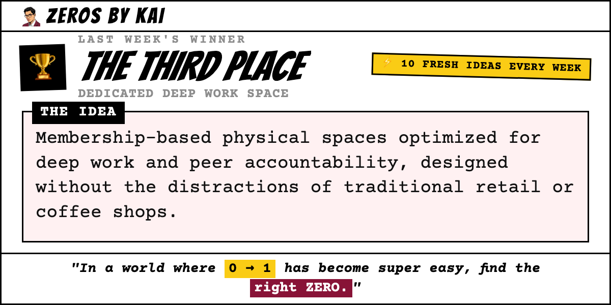

---

## 🕒 Scheduled: 2026-02-23T17:00:00.000Z

### 📝 Tweet Text:
```text
💡 Week of Feb 23, 2026 — Startup Idea #1 of the week.

GrowScript: Natural Language Growth Engineering

The Idea:
A logic engine that translates natural language intent into high-converting automation workflows, removing the technical barriers to rapid growth.

Why:
Founders are hindered by the complex conditional logic and technical friction found in legacy marketing stacks, which drastically slows execution speed.

Market Potential:
The market consistently signals a demand for tools that transform natural language instructions into actionable marketing automation, addressing a common 'complex hack' challenge.

Who it's for: Early-stage founders and growth teams

Would you build this? Vote for your favourite idea this week → http://localhost:3000

#startup #martech #automation #buildinpublic #indiehacker #startupideas #entrepreneurship #sideproject
```

### 🖼️ Image Preview:
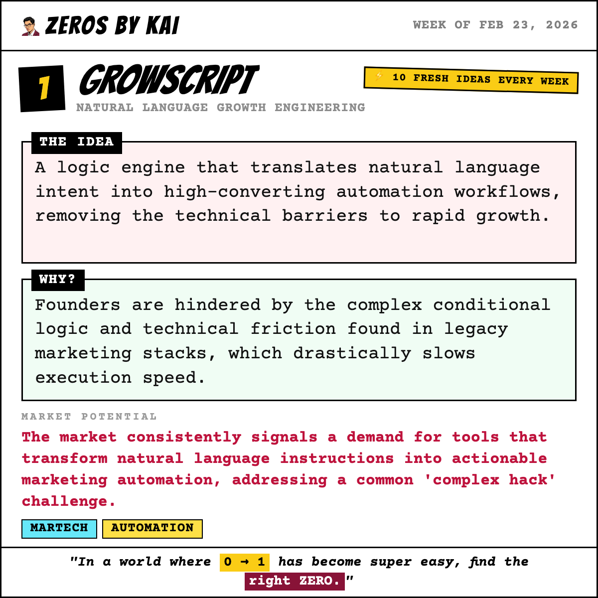

---

## 🕒 Scheduled: 2026-02-24T14:00:00.000Z

### 📝 Tweet Text:
```text
💡 Week of Feb 23, 2026 — Startup Idea #2 of the week.

Prism: Local-First Collaborative Media Engine

The Idea:
A WebGPU-powered browser environment that enables real-time collaboration via secure peer-to-peer links, allowing heavy rendering to stay on local hardware while teams work together remotely.

Why:
Professional video editing is throttled by massive cloud upload latencies and the security risks of hosting sensitive raw assets on external servers.

Market Potential:
Creators are demanding the performance of desktop applications with the collaborative ease of the web, without the friction of traditional cloud storage.

Who it's for: Privacy-Sensitive Creative Agencies

Would you build this? Vote for your favourite idea this week → http://localhost:3000

#startup #media #creativetech #buildinpublic #indiehacker #startupideas #entrepreneurship #sideproject
```

### 🖼️ Image Preview:
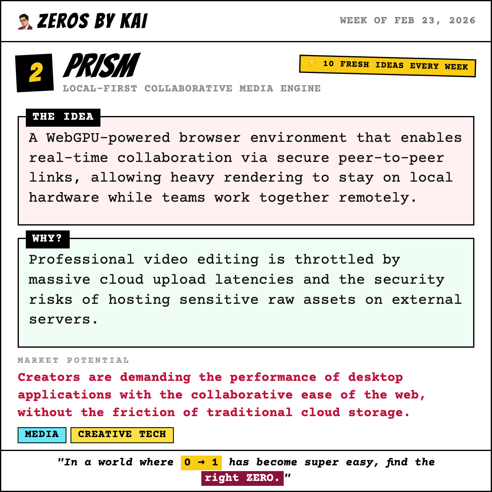

---

## 🕒 Scheduled: 2026-02-25T14:00:00.000Z

### 📝 Tweet Text:
```text
💡 Week of Feb 23, 2026 — Startup Idea #3 of the week.

SoloComp: Automated Personal Payroll Modeling

The Idea:
A streamlined decision engine that calculates the mathematically optimal way to distribute personal pay based on real-time cash flow and entity structure.

Why:
LLC owners face constant anxiety regarding the tax and legal distinctions between owner draws and salary, leading to expensive accounting errors and missed savings.

Market Potential:
This challenge consistently appears in online business communities, forcing founders into complex, error-prone manual workarounds to optimize their personal compensation.

Who it's for: First-time solo founders and US-based LLC owners.

Would you build this? Vote for your favourite idea this week → http://localhost:3000

#startup #finance #legal #buildinpublic #indiehacker #startupideas #entrepreneurship #sideproject
```

### 🖼️ Image Preview:
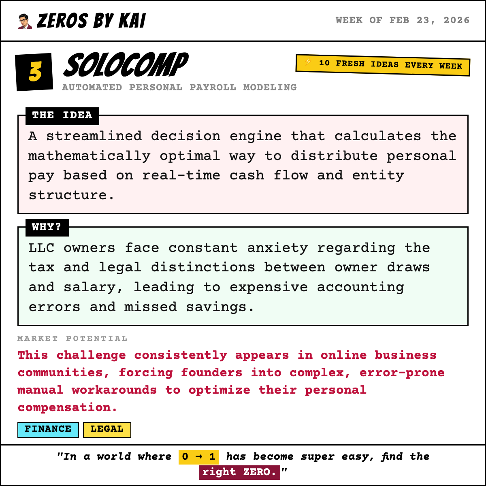

---

## 🕒 Scheduled: 2026-02-26T14:00:00.000Z

### 📝 Tweet Text:
```text
💡 Week of Feb 23, 2026 — Startup Idea #4 of the week.

Settlr: Non-Custodial B2B Settlements

The Idea:
A payment orchestration engine utilizing MPC and cryptographic escrow to enable programmatic, non-custodial asset settlement without third-party holding risk.

Why:
Businesses face catastrophic operational risk from centralized payment providers that unilaterally freeze capital based on opaque procedural errors.

Market Potential:
The shift toward real-time payments and regulatory scrutiny on institutional asset custody creates a high-urgency market for decentralized financial infrastructure that guarantees fund access and system integrity.

Who it's for: High-volume B2B providers and e-commerce platforms.

Would you build this? Vote for your favourite idea this week → http://localhost:3000

#startup #fintech #payments #buildinpublic #indiehacker #startupideas #entrepreneurship #sideproject
```

### 🖼️ Image Preview:
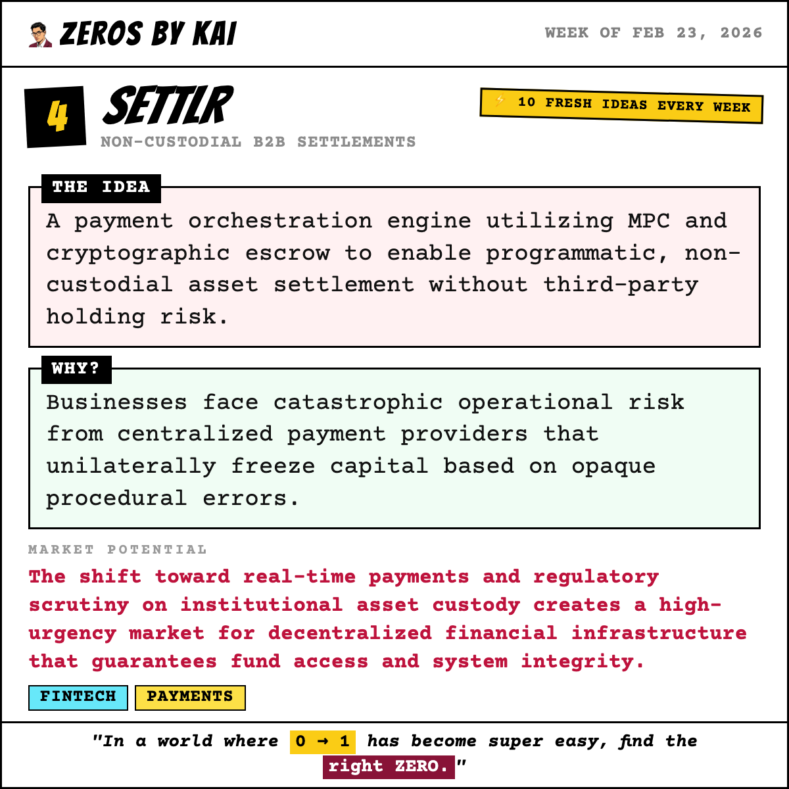

---

## 🕒 Scheduled: 2026-02-27T14:00:00.000Z

### 📝 Tweet Text:
```text
💡 Week of Feb 23, 2026 — Startup Idea #5 of the week.

FlowState: High-Velocity Distraction Filter

The Idea:
A network-level proxy that analyzes engagement velocity and scroll depth to identify and mitigate addictive algorithmic content in real-time across educational devices.

Why:
Traditional institutional filters block domains but fail to stop high-velocity, short-form video content that induces cognitive overload and erodes student focus.

Market Potential:
The shift to 1:1 device programs requires granular behavioral insights to combat the hidden learning drain caused by short-form, dopamine-loop content.

Who it's for: K-12 IT Administrators and school districts.

Would you build this? Vote for your favourite idea this week → http://localhost:3000

#startup #edtech #institutional #buildinpublic #indiehacker #startupideas #entrepreneurship #sideproject
```

### 🖼️ Image Preview:
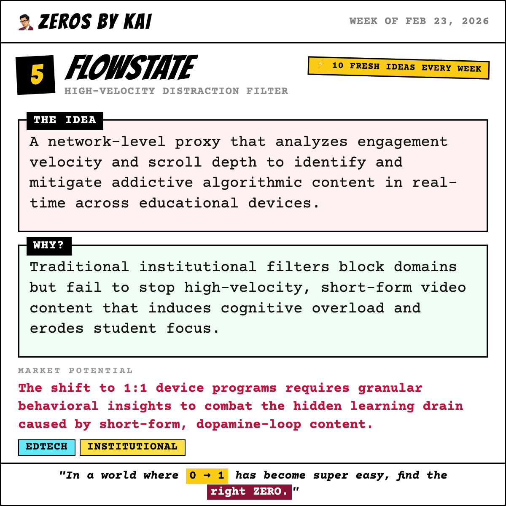

---

## 🕒 Scheduled: 2026-02-28T15:00:00.000Z

### 📝 Tweet Text:
```text
💡 Week of Feb 23, 2026 — Startup Idea #6 of the week.

FHIRFlow: FHIR R4 Health Data Integration

The Idea:
A developer-first bridge providing pre-built FHIR R4 API wrappers and automated compliance sandboxes to slash integration overhead and time-to-market.

Why:
HealthTech startups face massive technical and compliance hurdles when bridging consumer health data into professional EHR systems via FHIR R4.

Market Potential:
The increasing mandated interoperability (driven by standards like FHIR) creates urgent demand for tools that democratize access to the medical data ecosystem, currently dominated by large enterprise integrators.

Who it's for: Seed to Series A HealthTech startups.

Would you build this? Vote for your favourite idea this week → http://localhost:3000

#startup #healthtech #compliance #buildinpublic #indiehacker #startupideas #entrepreneurship #sideproject
```

### 🖼️ Image Preview:
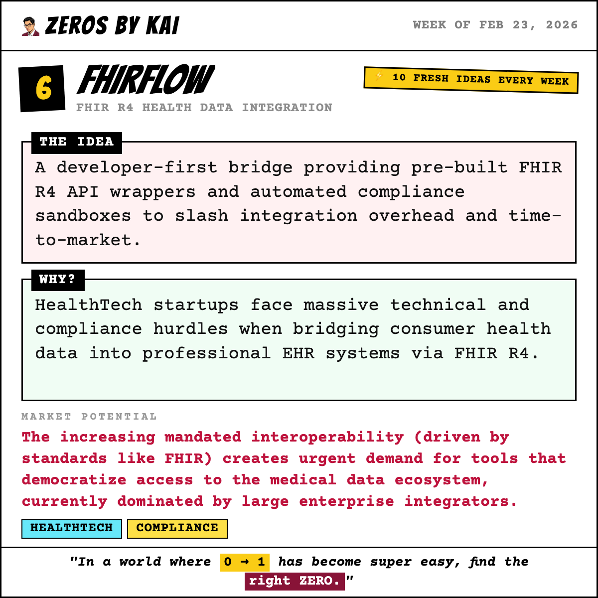

---

## 🕒 Scheduled: 2026-03-01T15:00:00.000Z

### 📝 Tweet Text:
```text
💡 Week of Feb 23, 2026 — Startup Idea #7 of the week.

Lattice: Zero-Knowledge Anti-Money Laundering

The Idea:
A cryptographic intelligence layer that allows institutions to run collective pattern-matching on encrypted data hashes, flagging criminal behavior without exposing sensitive customer details.

Why:
Financial criminals exploit the data siloes between banks, as strict privacy laws prevent institutions from sharing the information necessary to track cross-border money laundering.

Market Potential:
With AML regulatory fines escalating globally, banks need a standardized, privacy-preserving way to collaborate on threat intelligence.

Who it's for: Compliance Officers at Mid-Tier Banks and FinTechs

Would you build this? Vote for your favourite idea this week → http://localhost:3000

#startup #fintech #privacy #buildinpublic #indiehacker #startupideas #entrepreneurship #sideproject
```

### 🖼️ Image Preview:
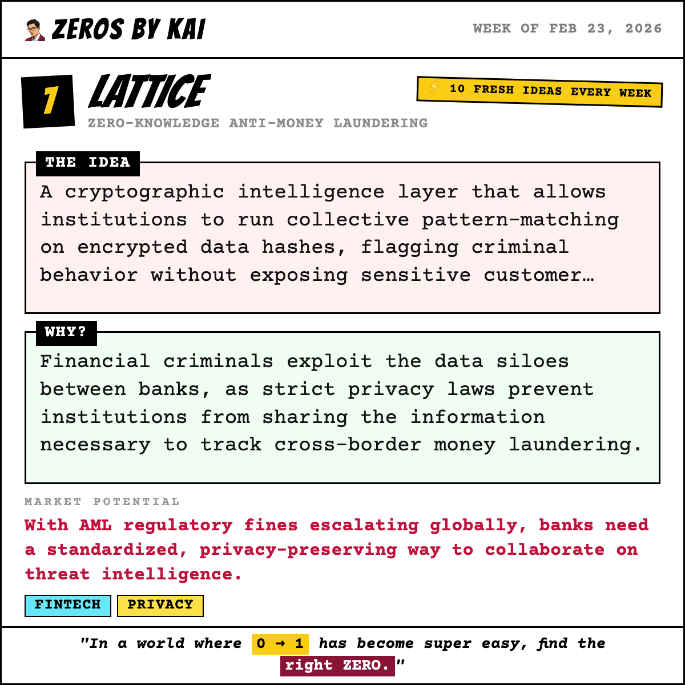

---

## 🕒 Scheduled: 2026-03-02T13:00:00.000Z

### 📝 Tweet Text:
```text
💡 Week of Feb 23, 2026 — Startup Idea #8 of the week.

Scoped: Velocity-Based Validation Engine

The Idea:
A framework-driven engine that mandates rigid validation sprints, integrating no-code stacks and automated user-interview logic to gather rapid market evidence.

Why:
Founders suffer from scope creep and decision paralysis during the critical transition from ideation to market validation, wasting capital on unproven features.

Market Potential:
Reducing the 'idea-to-validation' cycle is a high-value necessity in an accelerating startup ecosystem where speed is the primary competitive advantage.

Who it's for: Pre-seed solo founders and lean product teams.

Would you build this? Vote for your favourite idea this week → http://localhost:3000

#startup #founders #development #buildinpublic #indiehacker #startupideas #entrepreneurship #sideproject
```

### 🖼️ Image Preview:
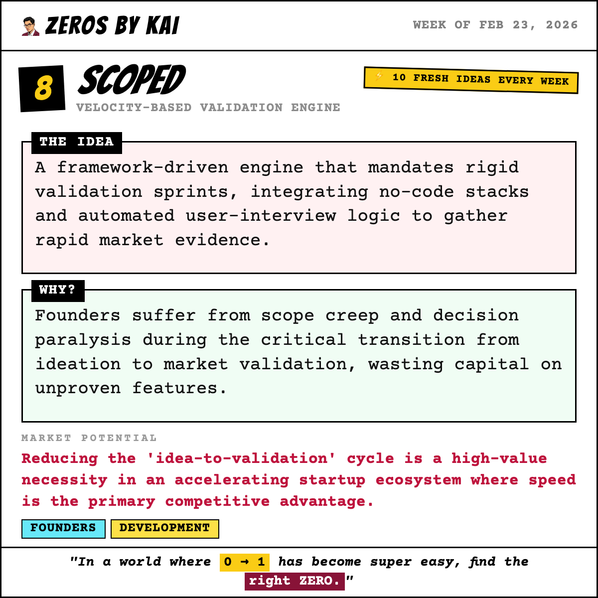

---

## 🕒 Scheduled: 2026-03-03T14:00:00.000Z

### 📝 Tweet Text:
```text
💡 Week of Feb 23, 2026 — Startup Idea #9 of the week.

Cradle: Passive Infant Health Intelligence

The Idea:
A specialized voice-capture engine that utilizes NLP to interpret unstructured, low-energy speech, instantly converting midnight verbal notes into structured medical records.

Why:
Sleep-deprived parents struggle with the friction of manual health logging, resulting in incomplete data for pediatric consultations and increased anxiety.

Market Potential:
By lowering input friction to zero, this captures critical health data currently lost to exhaustion, making data-driven parenting accessible to everyone.

Who it's for: New parents and pediatric caregivers.

Would you build this? Vote for your favourite idea this week → http://localhost:3000

#startup #health #parenting #buildinpublic #indiehacker #startupideas #entrepreneurship #sideproject
```

### 🖼️ Image Preview:
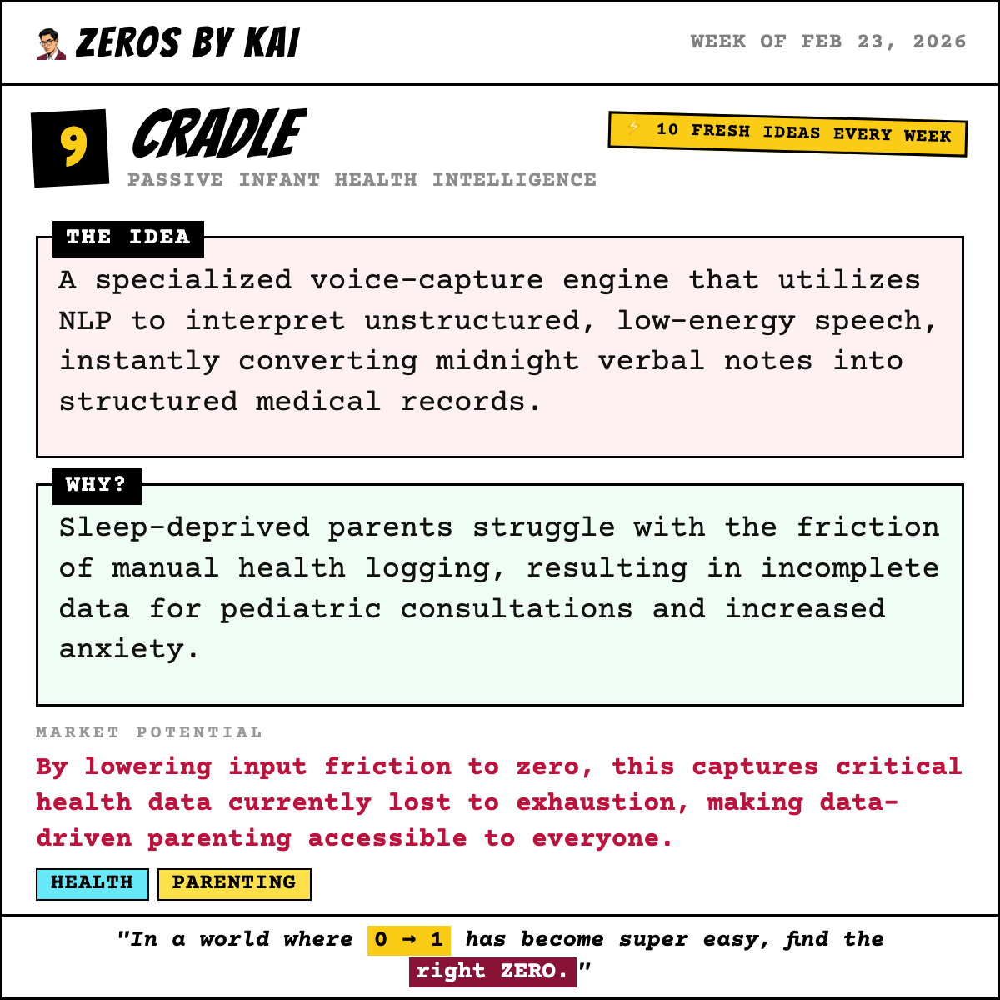

---

## 🕒 Scheduled: 2026-03-04T14:00:00.000Z

### 📝 Tweet Text:
```text
💡 Week of Feb 23, 2026 — Startup Idea #10 of the week.

BriefScout: Freelance Project Risk Intelligence

The Idea:
An intelligent risk-assessment tool for service providers. Before a proposal is sent, BriefScout runs the client's brief through an LLM trained on thousands of failed project post-mortems to highlight "red flags," missing technical specs, and potential "profit killers."

Why:
Freelance project failures are highest in the first 48 hours because of "silent assumptions" and "vague proposals." Contractors often don't understand the "risks, knowledge gaps, and scope creep" hidden in a client's brief.

Market Potential:
The freelance economy is projected to encompass 50% of the US workforce by 2027. Reducing the failure rate of "vague proposals" saves billions in unbilled hours and legal disputes, creating a massive opportunity for a "pre-contract" intelligence layer.

Who it's for: Fractional CTOs, marketing agencies, and freelancers.

Would you build this? Vote for your favourite idea this week → http://localhost:3000

#startup #legal #security #buildinpublic #indiehacker #startupideas #entrepreneurship #sideproject
```

### 🖼️ Image Preview:
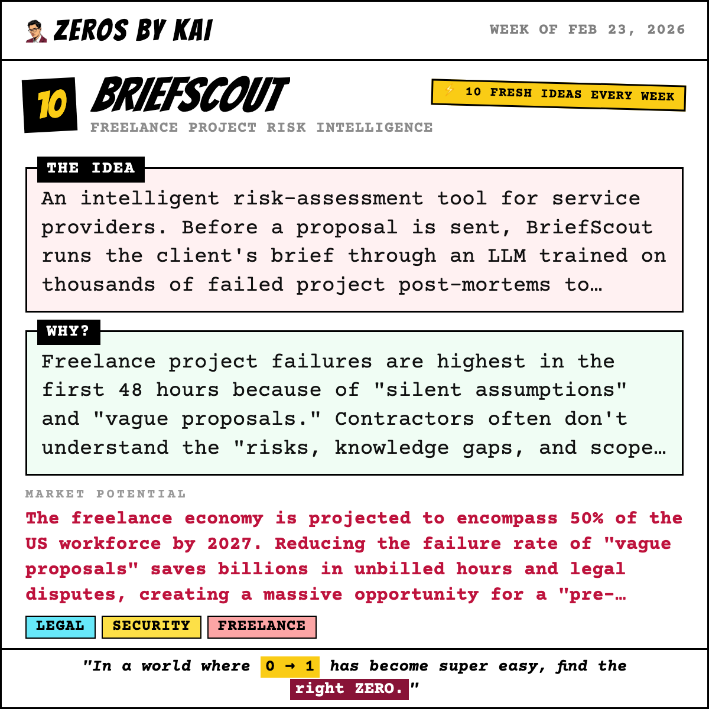

---

