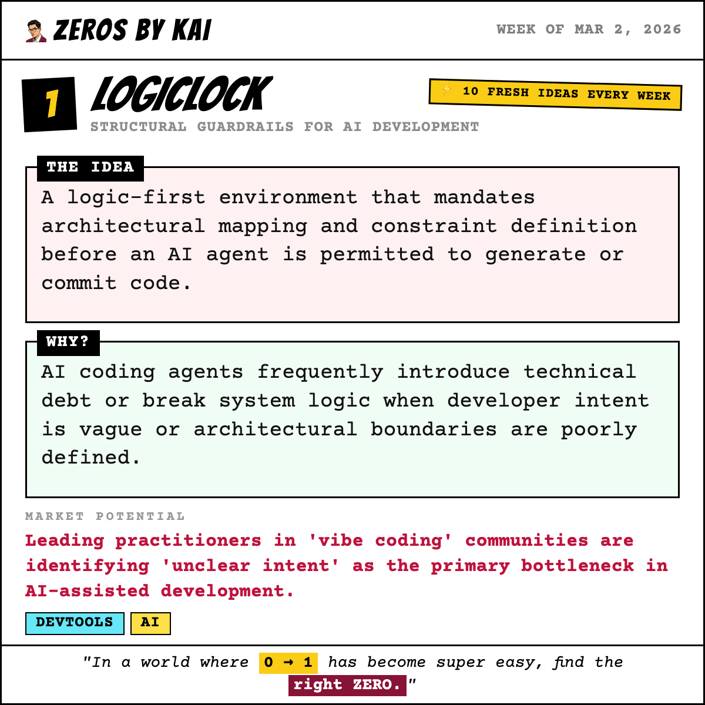
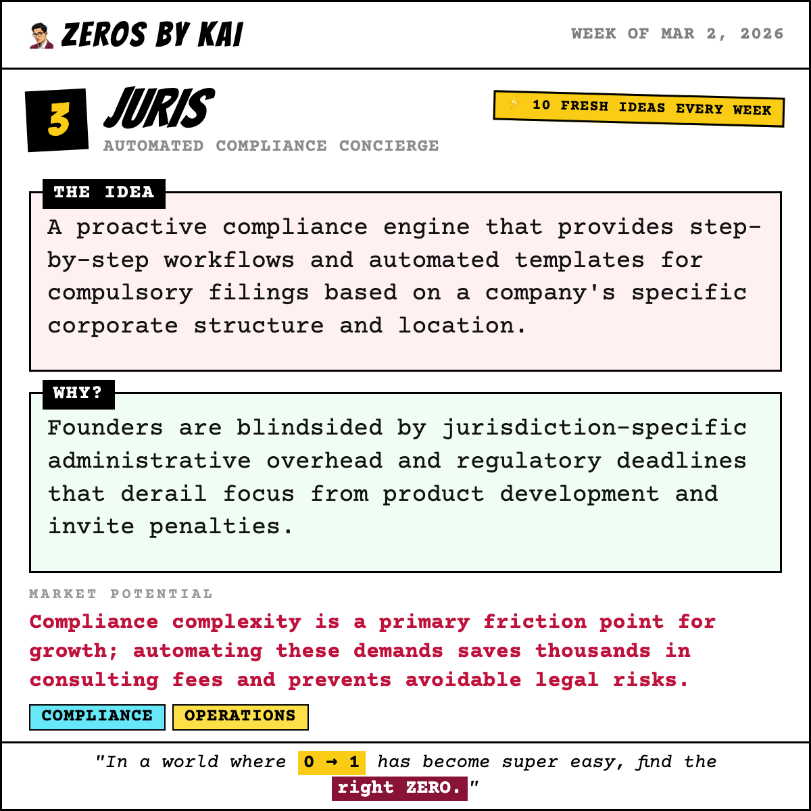
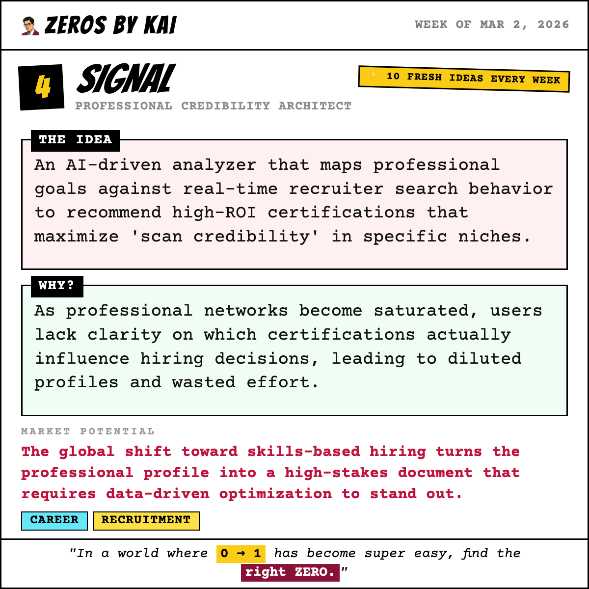
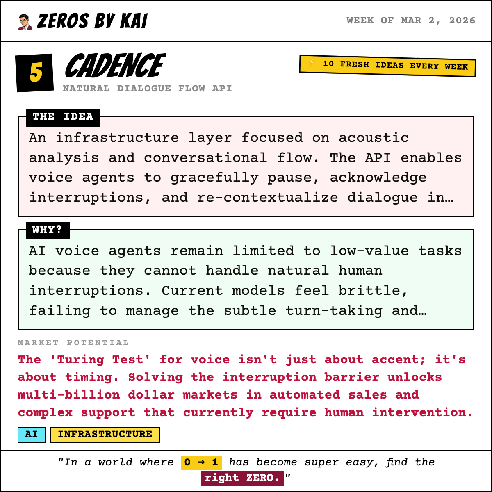
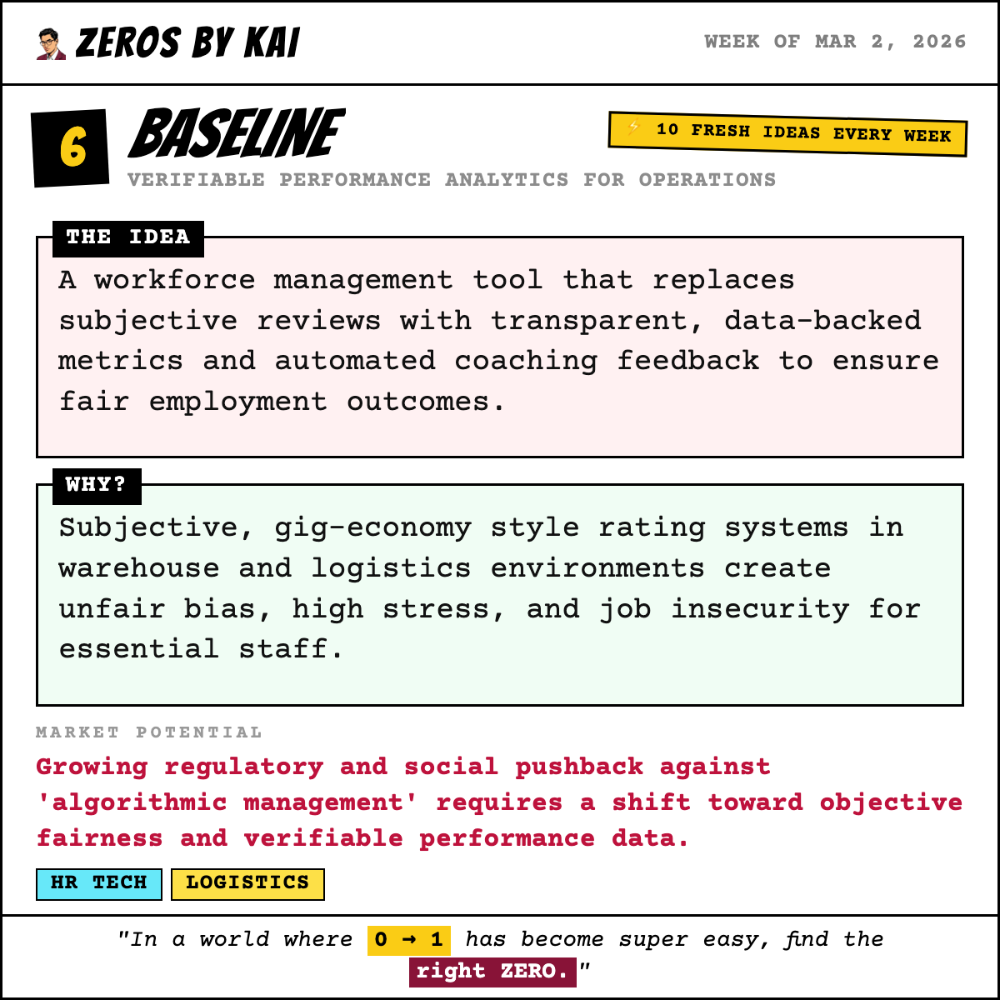
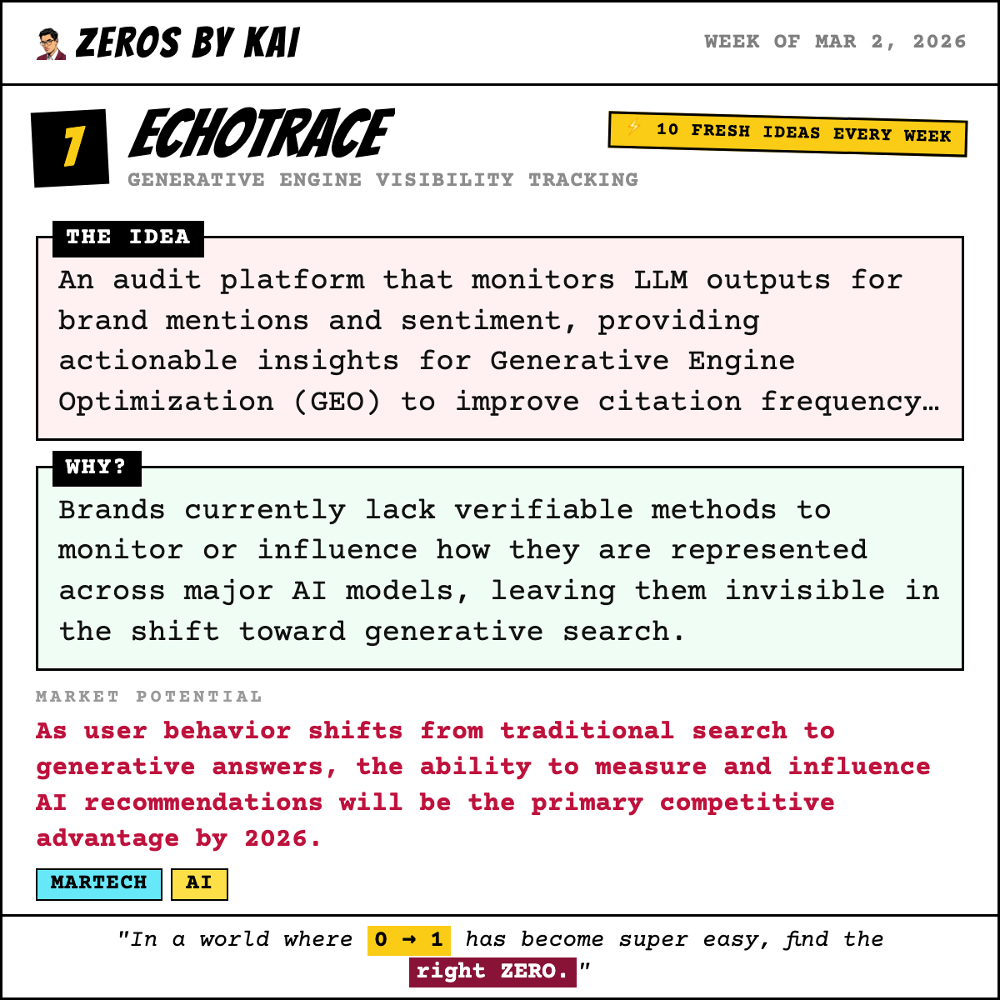
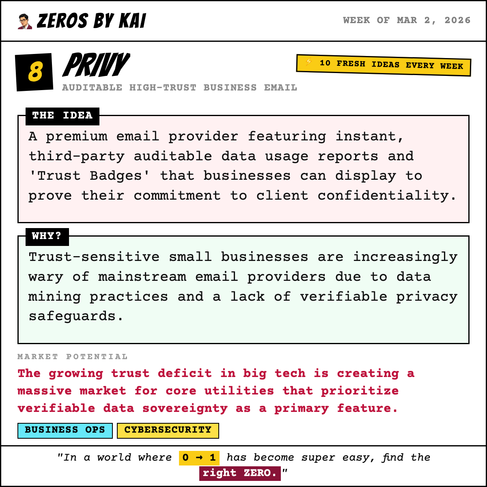
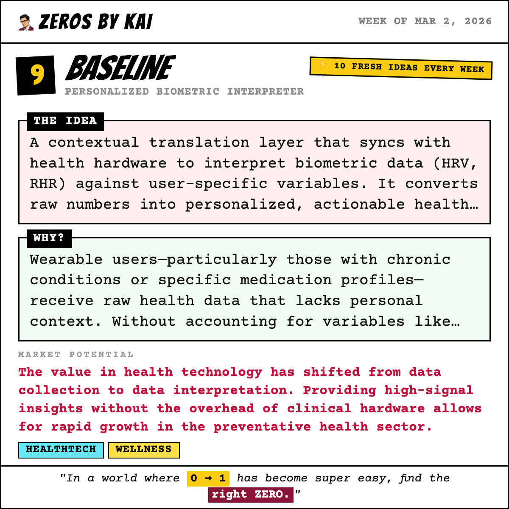
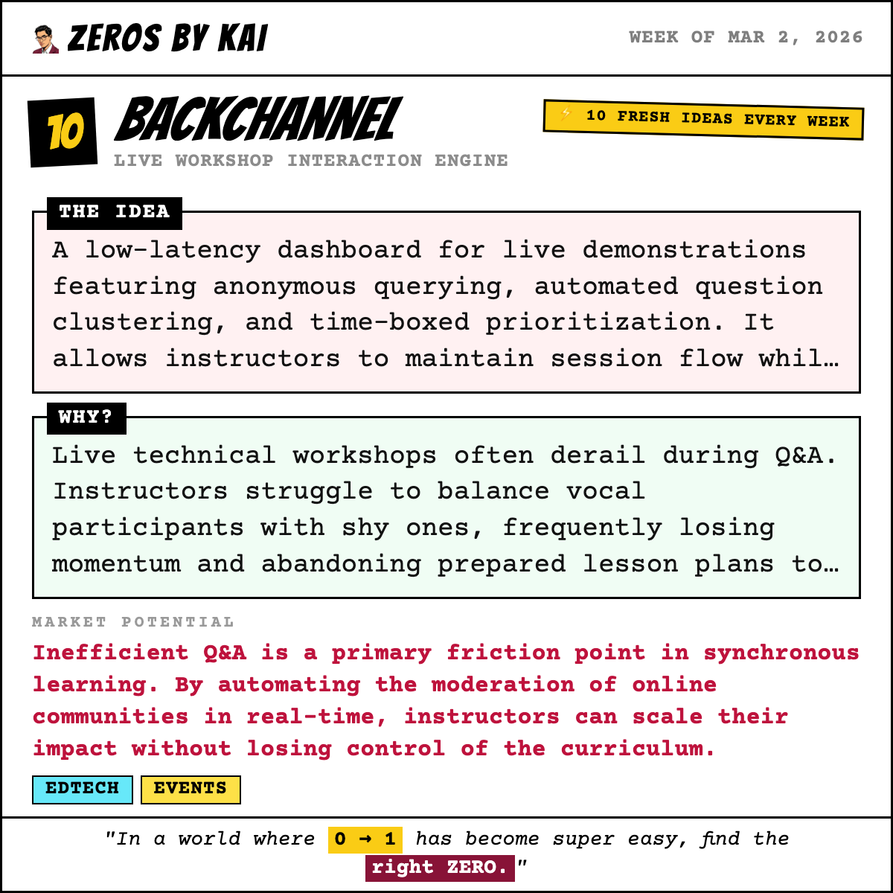

# 🐦 X Post Gallery - 2026-03-02T14:30:00.000Z

This file provides a preview of all generated posts. You can copy-paste the text directly into X.

---

## 🕒 Scheduled: 2026-03-02T14:30:00.000Z

### 📝 Tweet Text:
```text
🏆 Last week's winner is in.

The ZerosByKai community voted — and the startup idea that got the most votes this week was:

Scoped — Velocity-Based Validation Engine

The Idea:
A framework-driven engine that mandates rigid validation sprints, integrating no-code stacks and automated user-interview logic to gather rapid market evidence.

Why:
Founders suffer from scope creep and decision paralysis during the critical transition from ideation to market validation, wasting capital on unproven features.

The community saw the opportunity. Do you?

🆕 10 brand-new startup ideas just dropped today. One of them could be the next big thing.

Vote for your favourite → http://localhost:3000

#startup #buildinpublic #indiehacker #startupideas #entrepreneurship #sideproject #saas
```

### 🖼️ Image Preview:


---

## 🕒 Scheduled: 2026-03-02T17:00:00.000Z

### 📝 Tweet Text:
```text
💡 Week of Mar 2, 2026 — Startup Idea #1 of the week.

LogicLock: Structural Guardrails for AI Development

The Idea:
A logic-first environment that mandates architectural mapping and constraint definition before an AI agent is permitted to generate or commit code.

Why:
AI coding agents frequently introduce technical debt or break system logic when developer intent is vague or architectural boundaries are poorly defined.

Market Potential:
Leading practitioners in 'vibe coding' communities are identifying 'unclear intent' as the primary bottleneck in AI-assisted development.

Who it's for: Software architects and developers using AI-first IDEs.

Would you build this? Vote for your favourite idea this week → http://localhost:3000

#startup #devtools #ai #buildinpublic #indiehacker #startupideas #entrepreneurship #sideproject
```

### 🖼️ Image Preview:


---

## 🕒 Scheduled: 2026-03-03T14:00:00.000Z

### 📝 Tweet Text:
```text
💡 Week of Mar 2, 2026 — Startup Idea #2 of the week.

Suture: Semantic Clinical Note Structuring

The Idea:
A semantic middleware layer that identifies contextual shifts in real-time, automatically threading disjointed patient-doctor dialogue into structured HPI and Assessment notes.

Why:
Medical consultations are inherently non-linear, forcing physicians to spend hours manually untangling and re-categorizing fragmented transcripts into compliant clinical headers.

Market Potential:
As AI documentation adoption accelerates, the need to manage the quality and structure of output becomes the next bottleneck, saving high-value clinician time.

Who it's for: Specialist physicians and high-volume clinics

Would you build this? Vote for your favourite idea this week → http://localhost:3000

#startup #ai #healthtech #buildinpublic #indiehacker #startupideas #entrepreneurship #sideproject
```

### 🖼️ Image Preview:


---

## 🕒 Scheduled: 2026-03-04T14:00:00.000Z

### 📝 Tweet Text:
```text
💡 Week of Mar 2, 2026 — Startup Idea #3 of the week.

Juris: Automated Compliance Concierge

The Idea:
A proactive compliance engine that provides step-by-step workflows and automated templates for compulsory filings based on a company's specific corporate structure and location.

Why:
Founders are blindsided by jurisdiction-specific administrative overhead and regulatory deadlines that derail focus from product development and invite penalties.

Market Potential:
Compliance complexity is a primary friction point for growth; automating these demands saves thousands in consulting fees and prevents avoidable legal risks.

Who it's for: International founders and newly incorporated startups.

Would you build this? Vote for your favourite idea this week → http://localhost:3000

#startup #compliance #operations #buildinpublic #indiehacker #startupideas #entrepreneurship #sideproject
```

### 🖼️ Image Preview:


---

## 🕒 Scheduled: 2026-03-05T14:00:00.000Z

### 📝 Tweet Text:
```text
💡 Week of Mar 2, 2026 — Startup Idea #4 of the week.

Signal: Professional Credibility Architect

The Idea:
An AI-driven analyzer that maps professional goals against real-time recruiter search behavior to recommend high-ROI certifications that maximize 'scan credibility' in specific niches.

Why:
As professional networks become saturated, users lack clarity on which certifications actually influence hiring decisions, leading to diluted profiles and wasted effort.

Market Potential:
The global shift toward skills-based hiring turns the professional profile into a high-stakes document that requires data-driven optimization to stand out.

Who it's for: Mid-career professionals and high-growth graduates.

Would you build this? Vote for your favourite idea this week → http://localhost:3000

#startup #career #recruitment #buildinpublic #indiehacker #startupideas #entrepreneurship #sideproject
```

### 🖼️ Image Preview:


---

## 🕒 Scheduled: 2026-03-06T14:00:00.000Z

### 📝 Tweet Text:
```text
💡 Week of Mar 2, 2026 — Startup Idea #5 of the week.

Cadence: Natural Dialogue Flow API

The Idea:
An infrastructure layer focused on acoustic analysis and conversational flow. The API enables voice agents to gracefully pause, acknowledge interruptions, and re-contextualize dialogue in real-time, mimicking human social cues.

Why:
AI voice agents remain limited to low-value tasks because they cannot handle natural human interruptions. Current models feel brittle, failing to manage the subtle turn-taking and transitions required for high-intent conversations.

Market Potential:
The 'Turing Test' for voice isn't just about accent; it's about timing. Solving the interruption barrier unlocks multi-billion dollar markets in automated sales and complex support that currently require human intervention.

Who it's for: B2B Voice Automation Developers and Enterprise Contact Centers

Would you build this? Vote for your favourite idea this week → http://localhost:3000

#startup #ai #infrastructure #buildinpublic #indiehacker #startupideas #entrepreneurship #sideproject
```

### 🖼️ Image Preview:


---

## 🕒 Scheduled: 2026-03-07T15:00:00.000Z

### 📝 Tweet Text:
```text
💡 Week of Mar 2, 2026 — Startup Idea #6 of the week.

Baseline: Verifiable Performance Analytics for Operations

The Idea:
A workforce management tool that replaces subjective reviews with transparent, data-backed metrics and automated coaching feedback to ensure fair employment outcomes.

Why:
Subjective, gig-economy style rating systems in warehouse and logistics environments create unfair bias, high stress, and job insecurity for essential staff.

Market Potential:
Growing regulatory and social pushback against 'algorithmic management' requires a shift toward objective fairness and verifiable performance data.

Who it's for: E-commerce Fulfillment Centers and Logistics Firms

Would you build this? Vote for your favourite idea this week → http://localhost:3000

#startup #hrtech #logistics #buildinpublic #indiehacker #startupideas #entrepreneurship #sideproject
```

### 🖼️ Image Preview:


---

## 🕒 Scheduled: 2026-03-08T15:00:00.000Z

### 📝 Tweet Text:
```text
💡 Week of Mar 2, 2026 — Startup Idea #7 of the week.

EchoTrace: Generative Engine Visibility Tracking

The Idea:
An audit platform that monitors LLM outputs for brand mentions and sentiment, providing actionable insights for Generative Engine Optimization (GEO) to improve citation frequency and accuracy.

Why:
Brands currently lack verifiable methods to monitor or influence how they are represented across major AI models, leaving them invisible in the shift toward generative search.

Market Potential:
As user behavior shifts from traditional search to generative answers, the ability to measure and influence AI recommendations will be the primary competitive advantage by 2026.

Who it's for: Digital Marketing Agencies and Enterprise PR Teams

Would you build this? Vote for your favourite idea this week → http://localhost:3000

#startup #martech #ai #buildinpublic #indiehacker #startupideas #entrepreneurship #sideproject
```

### 🖼️ Image Preview:


---

## 🕒 Scheduled: 2026-03-09T13:00:00.000Z

### 📝 Tweet Text:
```text
💡 Week of Mar 2, 2026 — Startup Idea #8 of the week.

Privy: Auditable High-Trust Business Email

The Idea:
A premium email provider featuring instant, third-party auditable data usage reports and 'Trust Badges' that businesses can display to prove their commitment to client confidentiality.

Why:
Trust-sensitive small businesses are increasingly wary of mainstream email providers due to data mining practices and a lack of verifiable privacy safeguards.

Market Potential:
The growing trust deficit in big tech is creating a massive market for core utilities that prioritize verifiable data sovereignty as a primary feature.

Who it's for: Law Firms, Financial Advisors, and HealthTech Startups

Would you build this? Vote for your favourite idea this week → http://localhost:3000

#startup #businessops #cybersecurity #buildinpublic #indiehacker #startupideas #entrepreneurship #sideproject
```

### 🖼️ Image Preview:


---

## 🕒 Scheduled: 2026-03-10T14:00:00.000Z

### 📝 Tweet Text:
```text
💡 Week of Mar 2, 2026 — Startup Idea #9 of the week.

Baseline: Personalized Biometric Interpreter

The Idea:
A contextual translation layer that syncs with health hardware to interpret biometric data (HRV, RHR) against user-specific variables. It converts raw numbers into personalized, actionable health signals based on the user's unique physiological baseline.

Why:
Wearable users—particularly those with chronic conditions or specific medication profiles—receive raw health data that lacks personal context. Without accounting for variables like beta-blockers or stress, standard biometric readings are often misleading.

Market Potential:
The value in health technology has shifted from data collection to data interpretation. Providing high-signal insights without the overhead of clinical hardware allows for rapid growth in the preventative health sector.

Who it's for: Individuals managing chronic conditions or high-performance athletes using personalized feedback

Would you build this? Vote for your favourite idea this week → http://localhost:3000

#startup #healthtech #wellness #buildinpublic #indiehacker #startupideas #entrepreneurship #sideproject
```

### 🖼️ Image Preview:


---

## 🕒 Scheduled: 2026-03-11T14:00:00.000Z

### 📝 Tweet Text:
```text
💡 Week of Mar 2, 2026 — Startup Idea #10 of the week.

Backchannel: Live Workshop Interaction Engine

The Idea:
A low-latency dashboard for live demonstrations featuring anonymous querying, automated question clustering, and time-boxed prioritization. It allows instructors to maintain session flow while ensuring high-signal questions are addressed without manual moderation.

Why:
Live technical workshops often derail during Q&A. Instructors struggle to balance vocal participants with shy ones, frequently losing momentum and abandoning prepared lesson plans to manage chaotic dialogue.

Market Potential:
Inefficient Q&A is a primary friction point in synchronous learning. By automating the moderation of online communities in real-time, instructors can scale their impact without losing control of the curriculum.

Who it's for: University Professors, Corporate Trainers, and Technical Workshop Leads

Would you build this? Vote for your favourite idea this week → http://localhost:3000

#startup #edtech #events #buildinpublic #indiehacker #startupideas #entrepreneurship #sideproject
```

### 🖼️ Image Preview:


---

