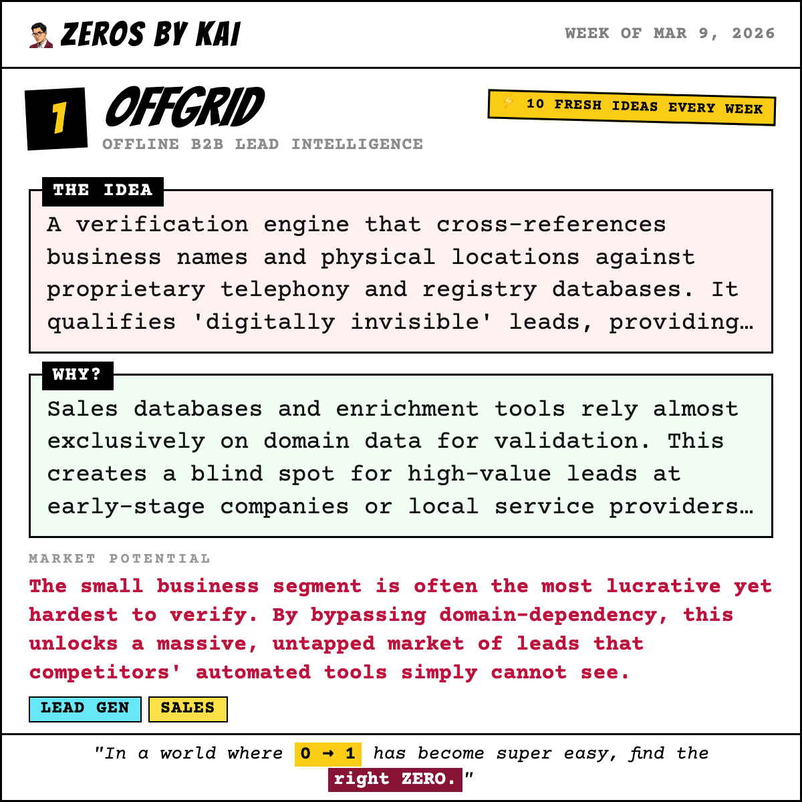
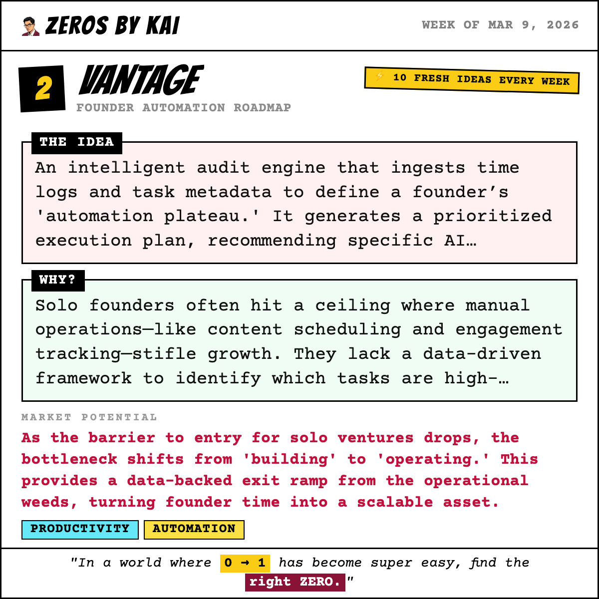
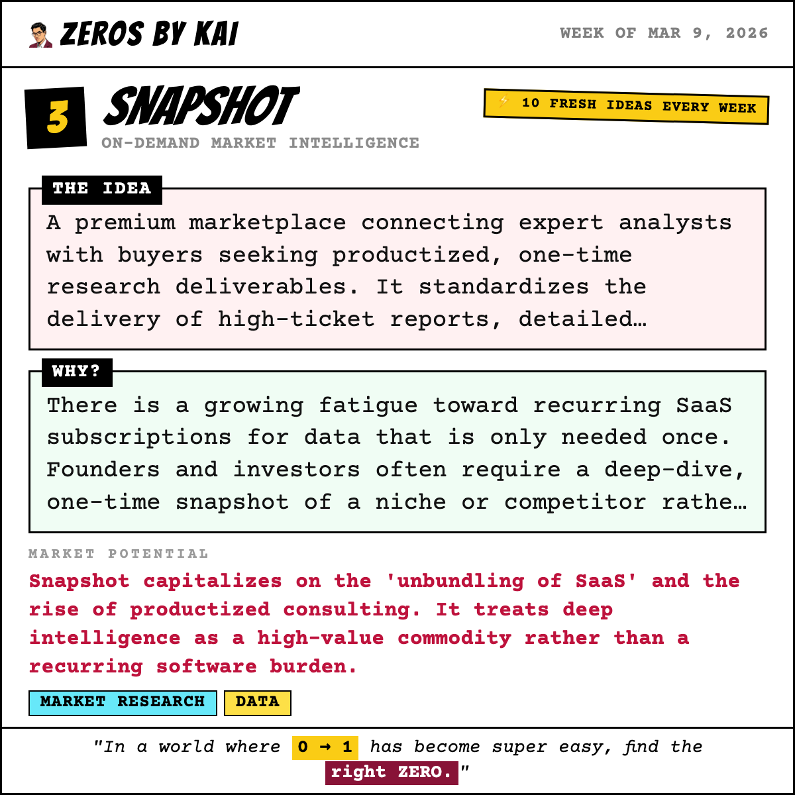
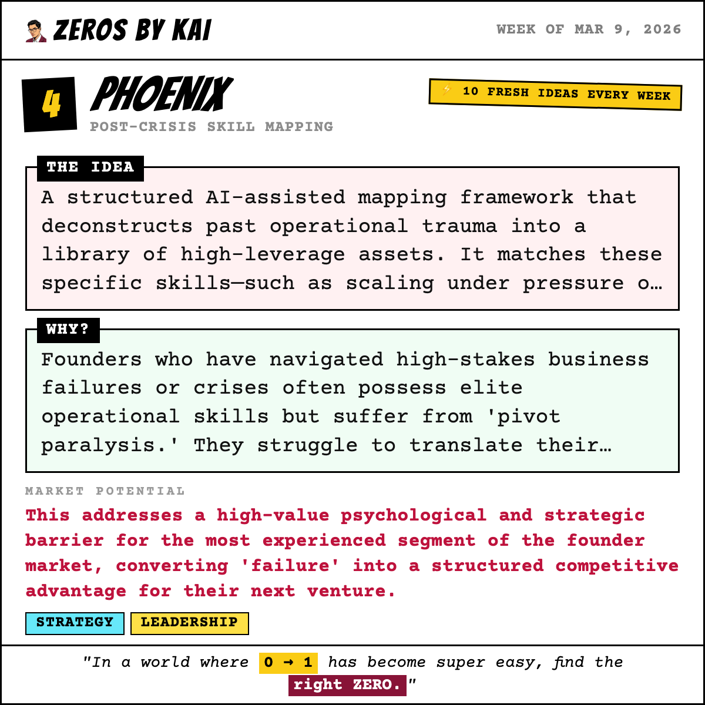
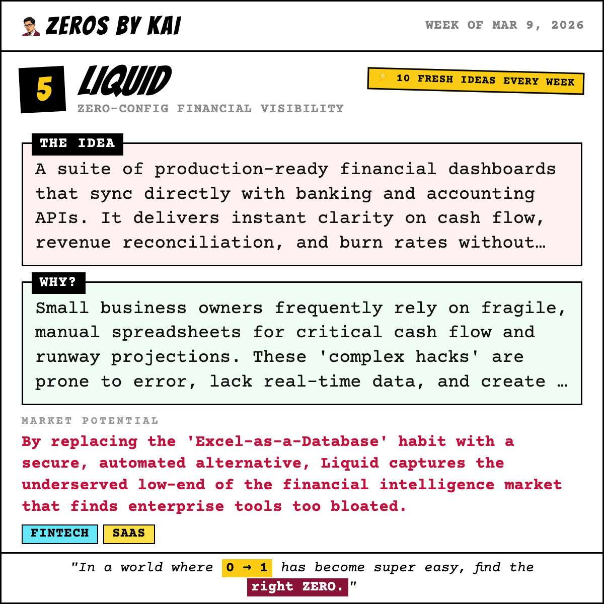
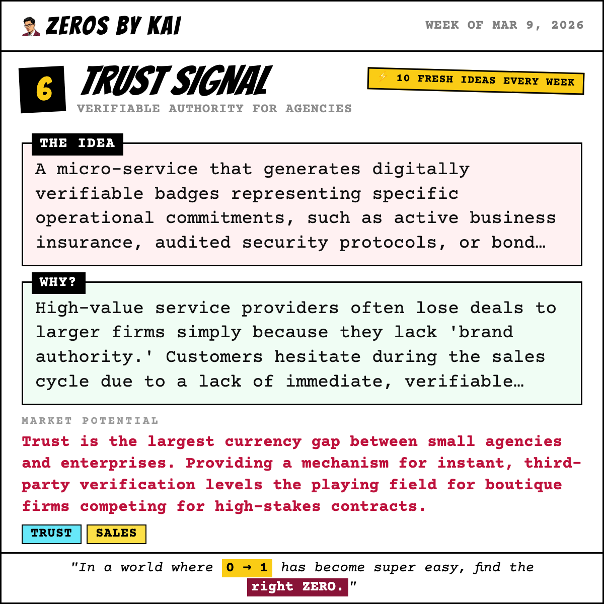
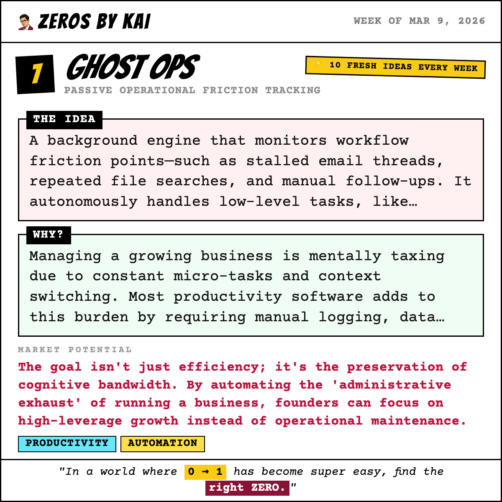
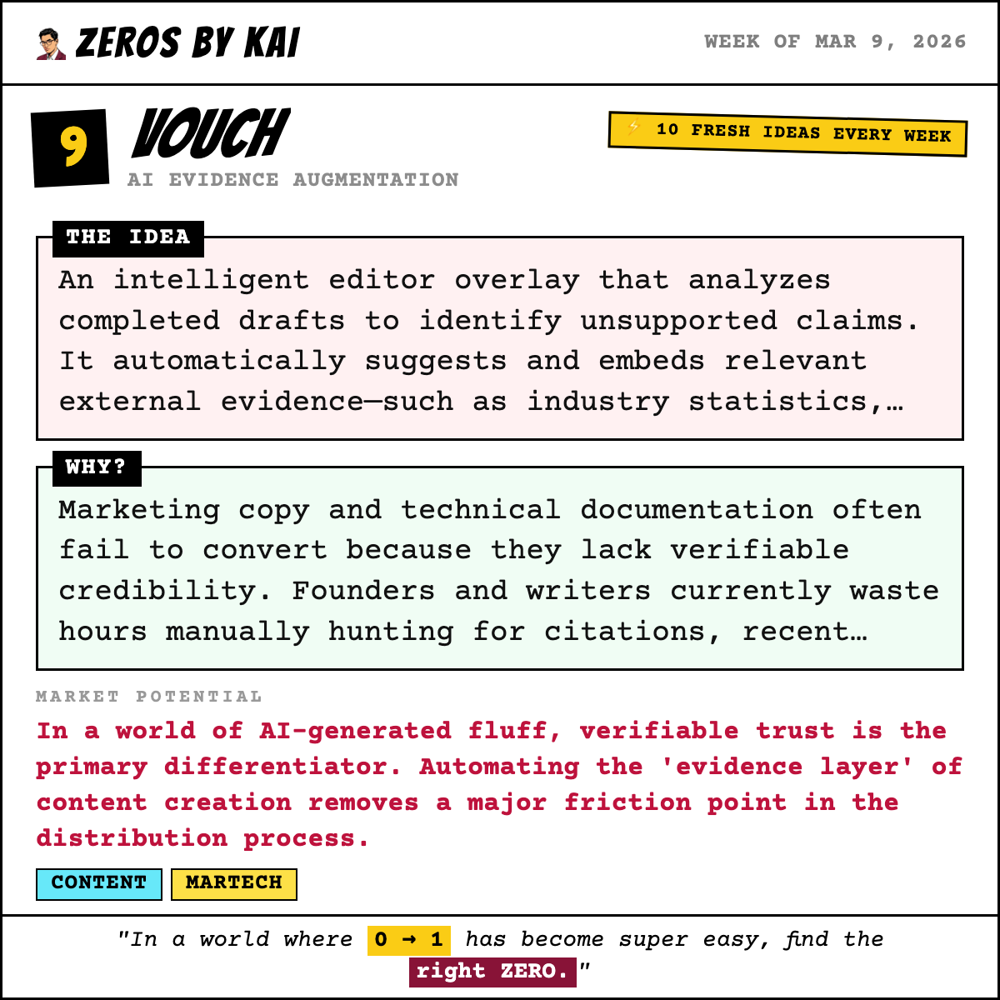
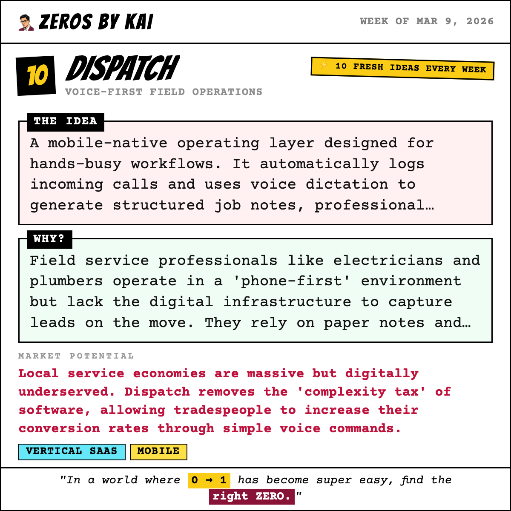

# 🐦 X Post Gallery - 2026-03-09T14:30:00.000Z

This file provides a preview of all generated posts. You can copy-paste the text directly into X.

---

## 🕒 Scheduled: 2026-03-09T14:30:00.000Z

### 📝 Tweet Text:
```text
🏆 Last week's winner is in.

The ZerosByKai community voted — and the startup idea that got the most votes this week was:

LogicLock — Structural Guardrails for AI Development

The Idea:
A logic-first environment that mandates architectural mapping and constraint definition before an AI agent is permitted to generate or commit code.

Why:
AI coding agents frequently introduce technical debt or break system logic when developer intent is vague or architectural boundaries are poorly defined.

The community saw the opportunity. Do you?

🆕 10 brand-new startup ideas just dropped today. One of them could be the next big thing.

Vote for your favourite → zerosbykai.com

#startup #buildinpublic #indiehacker #startupideas #entrepreneurship #sideproject #saas
```

### 🖼️ Image Preview:


---

## 🕒 Scheduled: 2026-03-09T17:00:00.000Z

### 📝 Tweet Text:
```text
💡 Week of Mar 9, 2026 — Startup Idea #1 of the week.

Offgrid: Offline B2B Lead Intelligence

The Idea:
A verification engine that cross-references business names and physical locations against proprietary telephony and registry databases. It qualifies 'digitally invisible' leads, providing sales teams with verified contacts before they appear in mainstream digital directories.

Why:
Sales databases and enrichment tools rely almost exclusively on domain data for validation. This creates a blind spot for high-value leads at early-stage companies or local service providers that possess physical addresses and phone numbers but haven't established a mature digital footprint yet.

Market Potential:
The small business segment is often the most lucrative yet hardest to verify. By bypassing domain-dependency, this unlocks a massive, untapped market of leads that competitors' automated tools simply cannot see.

Who it's for: Business Development teams targeting local service industries and stealth-mode startups.

Would you build this? Vote for your favourite idea this week → zerosbykai.com

#startup #leadgen #sales #buildinpublic #indiehacker #startupideas #entrepreneurship #sideproject
```

### 🖼️ Image Preview:


---

## 🕒 Scheduled: 2026-03-10T14:00:00.000Z

### 📝 Tweet Text:
```text
💡 Week of Mar 9, 2026 — Startup Idea #2 of the week.

Vantage: Founder Automation Roadmap

The Idea:
An intelligent audit engine that ingests time logs and task metadata to define a founder’s 'automation plateau.' It generates a prioritized execution plan, recommending specific AI workflows or micro-outsourcing options to reclaim high-value focus time.

Why:
Solo founders often hit a ceiling where manual operations—like content scheduling and engagement tracking—stifle growth. They lack a data-driven framework to identify which tasks are high-leverage and which should be offloaded to prevent burnout.

Market Potential:
As the barrier to entry for solo ventures drops, the bottleneck shifts from 'building' to 'operating.' This provides a data-backed exit ramp from the operational weeds, turning founder time into a scalable asset.

Who it's for: Solo founders and bootstrapped entrepreneurs managing multiple projects.

Would you build this? Vote for your favourite idea this week → zerosbykai.com

#startup #productivity #automation #buildinpublic #indiehacker #startupideas #entrepreneurship #sideproject
```

### 🖼️ Image Preview:


---

## 🕒 Scheduled: 2026-03-11T14:00:00.000Z

### 📝 Tweet Text:
```text
💡 Week of Mar 9, 2026 — Startup Idea #3 of the week.

Snapshot: On-Demand Market Intelligence

The Idea:
A premium marketplace connecting expert analysts with buyers seeking productized, one-time research deliverables. It standardizes the delivery of high-ticket reports, detailed datasets, and competitive swipe files as standalone purchases.

Why:
There is a growing fatigue toward recurring SaaS subscriptions for data that is only needed once. Founders and investors often require a deep-dive, one-time snapshot of a niche or competitor rather than a monthly monitoring tool they rarely open.

Market Potential:
Snapshot capitalizes on the 'unbundling of SaaS' and the rise of productized consulting. It treats deep intelligence as a high-value commodity rather than a recurring software burden.

Who it's for: Indie hackers, angel investors, and niche researchers.

Would you build this? Vote for your favourite idea this week → zerosbykai.com

#startup #marketresearch #data #buildinpublic #indiehacker #startupideas #entrepreneurship #sideproject
```

### 🖼️ Image Preview:


---

## 🕒 Scheduled: 2026-03-12T14:00:00.000Z

### 📝 Tweet Text:
```text
💡 Week of Mar 9, 2026 — Startup Idea #4 of the week.

Phoenix: Post-Crisis Skill Mapping

The Idea:
A structured AI-assisted mapping framework that deconstructs past operational trauma into a library of high-leverage assets. It matches these specific skills—such as scaling under pressure or legal navigation—with immediate, investable niches.

Why:
Founders who have navigated high-stakes business failures or crises often possess elite operational skills but suffer from 'pivot paralysis.' They struggle to translate their high-pressure experience into new, viable opportunities in emerging sectors like AI.

Market Potential:
This addresses a high-value psychological and strategic barrier for the most experienced segment of the founder market, converting 'failure' into a structured competitive advantage for their next venture.

Who it's for: Serial entrepreneurs and founders post-exit or post-failure.

Would you build this? Vote for your favourite idea this week → zerosbykai.com

#startup #strategy #leadership #buildinpublic #indiehacker #startupideas #entrepreneurship #sideproject
```

### 🖼️ Image Preview:


---

## 🕒 Scheduled: 2026-03-13T14:00:00.000Z

### 📝 Tweet Text:
```text
💡 Week of Mar 9, 2026 — Startup Idea #5 of the week.

Liquid: Zero-Config Financial Visibility

The Idea:
A suite of production-ready financial dashboards that sync directly with banking and accounting APIs. It delivers instant clarity on cash flow, revenue reconciliation, and burn rates without requiring formula knowledge or manual data entry.

Why:
Small business owners frequently rely on fragile, manual spreadsheets for critical cash flow and runway projections. These 'complex hacks' are prone to error, lack real-time data, and create a significant security risk for sensitive financial modeling.

Market Potential:
By replacing the 'Excel-as-a-Database' habit with a secure, automated alternative, Liquid captures the underserved low-end of the financial intelligence market that finds enterprise tools too bloated.

Who it's for: Non-financial SMB owners and boutique consulting agencies.

Would you build this? Vote for your favourite idea this week → zerosbykai.com

#startup #fintech #saas #buildinpublic #indiehacker #startupideas #entrepreneurship #sideproject
```

### 🖼️ Image Preview:


---

## 🕒 Scheduled: 2026-03-14T15:00:00.000Z

### 📝 Tweet Text:
```text
💡 Week of Mar 9, 2026 — Startup Idea #6 of the week.

Trust Signal: Verifiable Authority for Agencies

The Idea:
A micro-service that generates digitally verifiable badges representing specific operational commitments, such as active business insurance, audited security protocols, or bond status. These markers allow prospects to verify a provider's credentials via a single click, shifting trust from reputation to data.

Why:
High-value service providers often lose deals to larger firms simply because they lack 'brand authority.' Customers hesitate during the sales cycle due to a lack of immediate, verifiable proof regarding operational security and business legitimacy.

Market Potential:
Trust is the largest currency gap between small agencies and enterprises. Providing a mechanism for instant, third-party verification levels the playing field for boutique firms competing for high-stakes contracts.

Who it's for: Professional agencies, consultants, and technical service providers.

Would you build this? Vote for your favourite idea this week → zerosbykai.com

#startup #trust #sales #buildinpublic #indiehacker #startupideas #entrepreneurship #sideproject
```

### 🖼️ Image Preview:


---

## 🕒 Scheduled: 2026-03-15T15:00:00.000Z

### 📝 Tweet Text:
```text
💡 Week of Mar 9, 2026 — Startup Idea #7 of the week.

Ghost Ops: Passive Operational Friction Tracking

The Idea:
A background engine that monitors workflow friction points—such as stalled email threads, repeated file searches, and manual follow-ups. It autonomously handles low-level tasks, like drafting follow-up emails or logging contact activity, without requiring the user to leave their existing workspace.

Why:
Managing a growing business is mentally taxing due to constant micro-tasks and context switching. Most productivity software adds to this burden by requiring manual logging, data entry, and dashboard management.

Market Potential:
The goal isn't just efficiency; it's the preservation of cognitive bandwidth. By automating the 'administrative exhaust' of running a business, founders can focus on high-leverage growth instead of operational maintenance.

Who it's for: Burned-out founders and small business operators managing high-touch workflows.

Would you build this? Vote for your favourite idea this week → zerosbykai.com

#startup #productivity #automation #buildinpublic #indiehacker #startupideas #entrepreneurship #sideproject
```

### 🖼️ Image Preview:


---

## 🕒 Scheduled: 2026-03-16T13:00:00.000Z

### 📝 Tweet Text:
```text
💡 Week of Mar 9, 2026 — Startup Idea #8 of the week.

Synapse: Unified Context Layer for Engineering

The Idea:
A middleware layer that securely indexes and unifies disparate internal data sources into a single, performance-optimized API. This creates a 'conversational data layer' that allows humans and AI agents to query the entire engineering stack through a single interface.

Why:
Engineering teams waste significant time toggling between siloed tools like Jira, GitHub, and Datadog to answer basic questions. This 'tool sprawl' prevents internal AI assistants from accessing the full context needed to be truly useful.

Market Potential:
As specialized AI agents become standard in the workplace, the primary bottleneck is no longer processing power, but secure, unified access to internal context. This solves the data fragmentation problem at the source.

Who it's for: Mid-market engineering teams adopting AI automation and struggling with fragmented data.

Would you build this? Vote for your favourite idea this week → zerosbykai.com

#startup #devtools #devops #buildinpublic #indiehacker #startupideas #entrepreneurship #sideproject
```

### 🖼️ Image Preview:


---

## 🕒 Scheduled: 2026-03-17T14:00:00.000Z

### 📝 Tweet Text:
```text
💡 Week of Mar 9, 2026 — Startup Idea #9 of the week.

Vouch: AI Evidence Augmentation

The Idea:
An intelligent editor overlay that analyzes completed drafts to identify unsupported claims. It automatically suggests and embeds relevant external evidence—such as industry statistics, press mentions, or anonymized testimonials—to instantly boost reader trust.

Why:
Marketing copy and technical documentation often fail to convert because they lack verifiable credibility. Founders and writers currently waste hours manually hunting for citations, recent statistics, and social proof to back up their claims after a draft is finished.

Market Potential:
In a world of AI-generated fluff, verifiable trust is the primary differentiator. Automating the 'evidence layer' of content creation removes a major friction point in the distribution process.

Who it's for: Solo founders, technical content creators, and marketing teams in high-stakes industries.

Would you build this? Vote for your favourite idea this week → zerosbykai.com

#startup #content #martech #buildinpublic #indiehacker #startupideas #entrepreneurship #sideproject
```

### 🖼️ Image Preview:


---

## 🕒 Scheduled: 2026-03-18T14:00:00.000Z

### 📝 Tweet Text:
```text
💡 Week of Mar 9, 2026 — Startup Idea #10 of the week.

Dispatch: Voice-First Field Operations

The Idea:
A mobile-native operating layer designed for hands-busy workflows. It automatically logs incoming calls and uses voice dictation to generate structured job notes, professional quotes, and follow-up texts, professionalizing the business without a keyboard.

Why:
Field service professionals like electricians and plumbers operate in a 'phone-first' environment but lack the digital infrastructure to capture leads on the move. They rely on paper notes and memory, leading to missed follow-ups and lost revenue because traditional CRMs are too cumbersome for mobile use.

Market Potential:
Local service economies are massive but digitally underserved. Dispatch removes the 'complexity tax' of software, allowing tradespeople to increase their conversion rates through simple voice commands.

Who it's for: Independent contractors and field service solopreneurs.

Would you build this? Vote for your favourite idea this week → zerosbykai.com

#startup #verticalsaas #mobile #buildinpublic #indiehacker #startupideas #entrepreneurship #sideproject
```

### 🖼️ Image Preview:


---

