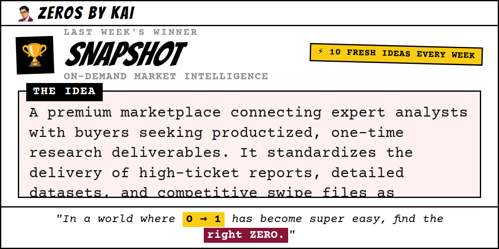
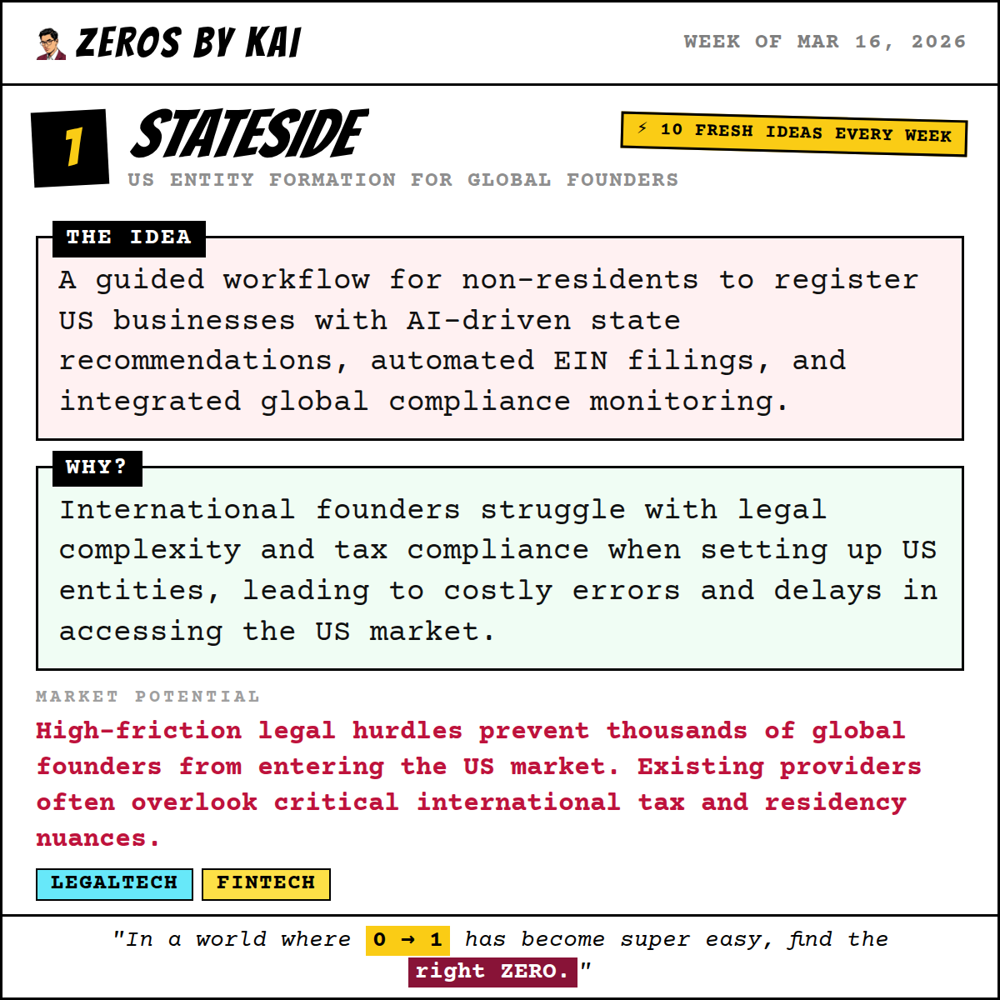
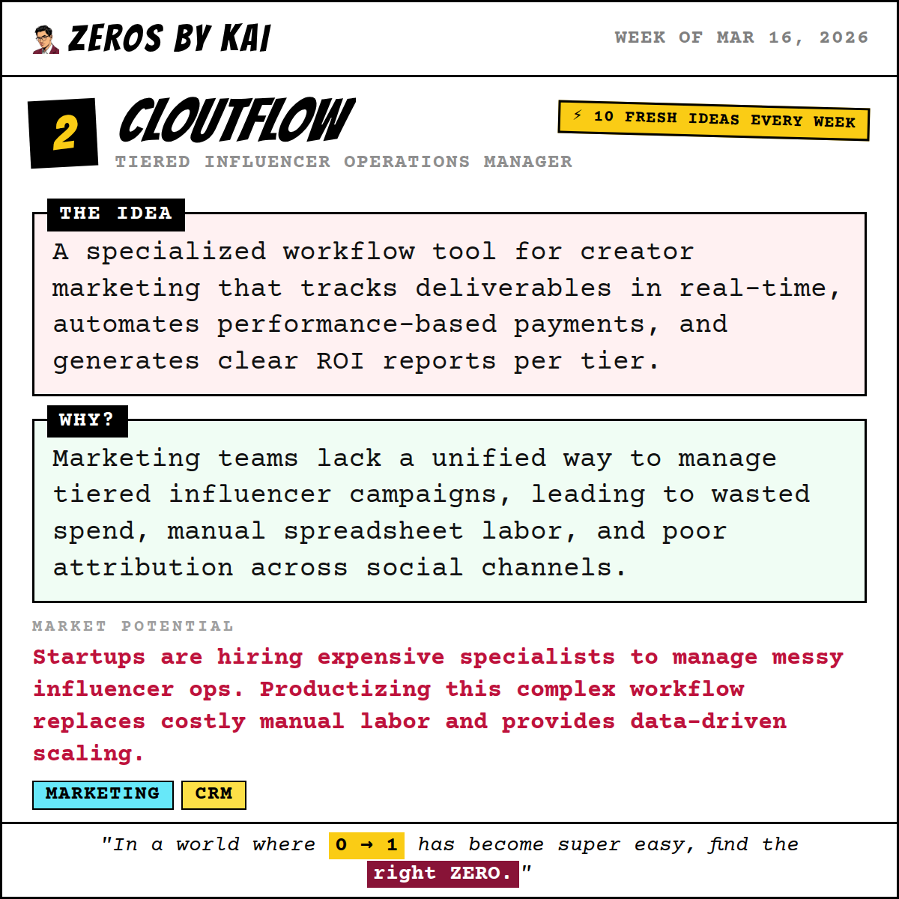
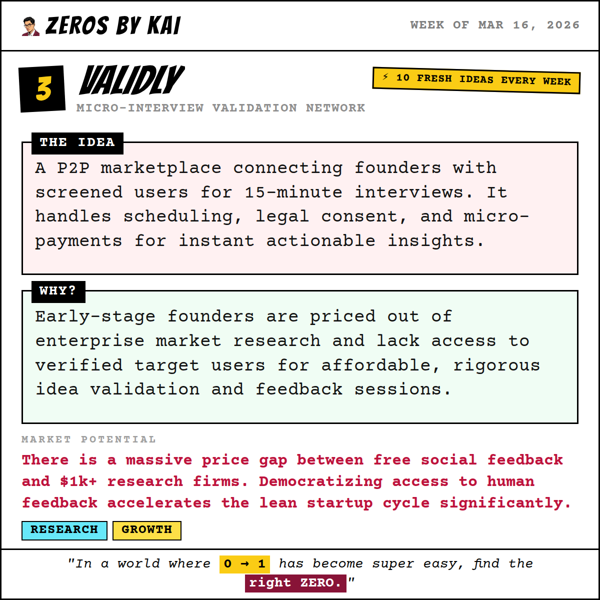
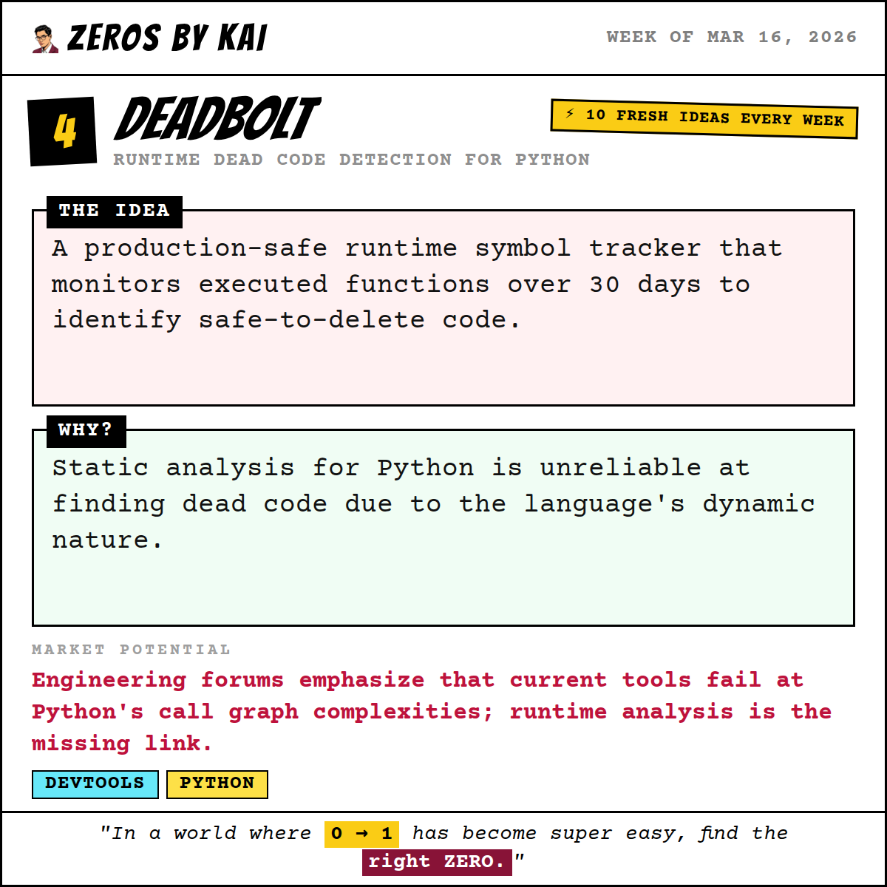
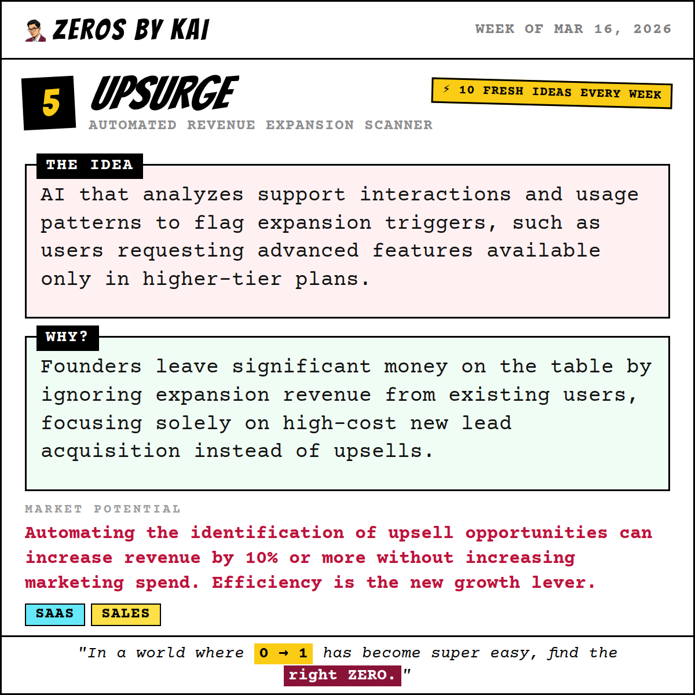
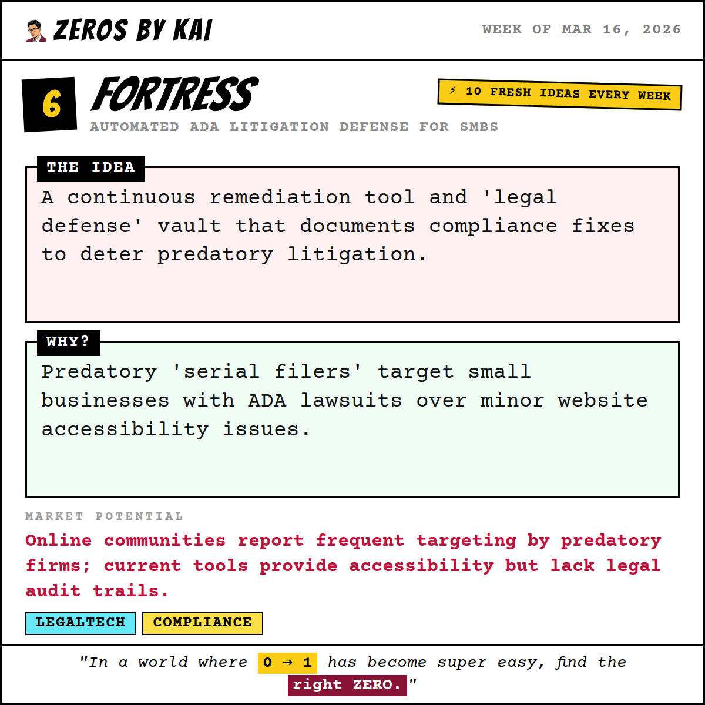
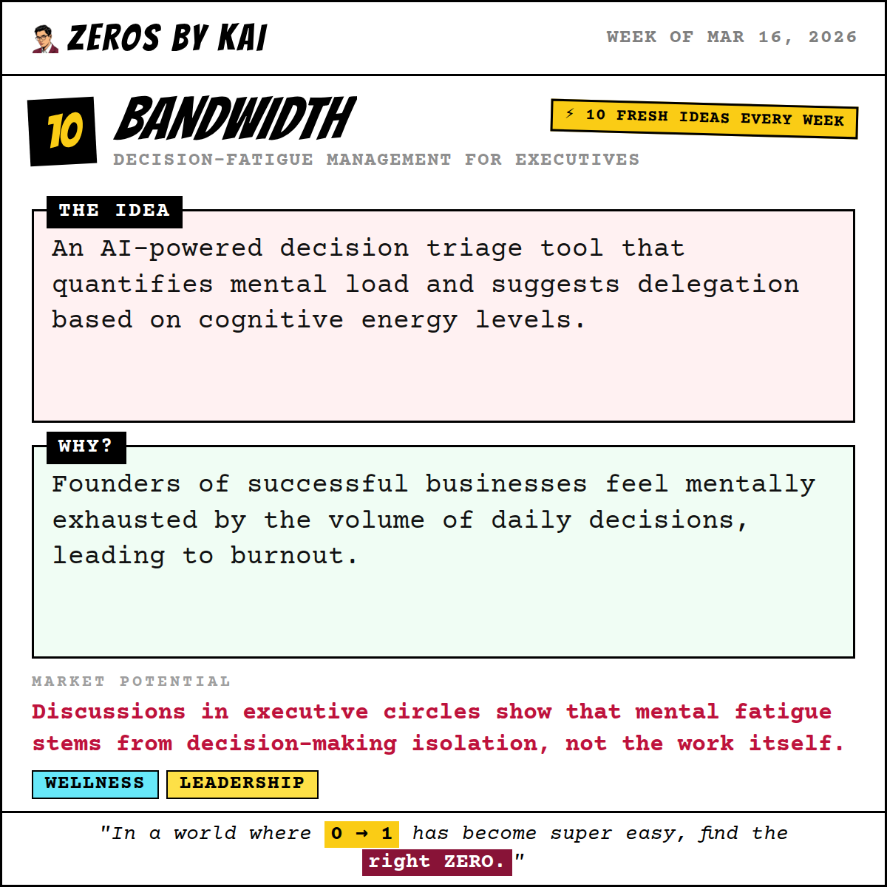

# 🐦 X Post Gallery - 2026-03-16T14:30:00.000Z

This file provides a preview of all generated posts. You can copy-paste the text directly into X.

---

## 🕒 Scheduled: 2026-03-16T14:30:00.000Z

### 📝 Tweet Text:
```text
🏆 Last week's winner is in.

The ZerosByKai community voted — and the startup idea that got the most votes this week was:

Snapshot — On-Demand Market Intelligence

The Idea:
A premium marketplace connecting expert analysts with buyers seeking productized, one-time research deliverables. It standardizes the delivery of high-ticket reports, detailed datasets, and competitive swipe files as standalone purchases.

Why:
There is a growing fatigue toward recurring SaaS subscriptions for data that is only needed once. Founders and investors often require a deep-dive, one-time snapshot of a niche or competitor rather than a monthly monitoring tool they rarely open.

The community saw the opportunity. Do you?

🆕 10 brand-new startup ideas just dropped today. One of them could be the next big thing.

Vote for your favourite → zerosbykai.com

#startup #buildinpublic #indiehacker #startupideas #entrepreneurship #sideproject #saas
```

### 🖼️ Image Preview:


---

## 🕒 Scheduled: 2026-03-16T17:00:00.000Z

### 📝 Tweet Text:
```text
💡 Week of Mar 16, 2026 — Startup Idea #1 of the week.

Stateside: US Entity Formation for Global Founders

The Idea:
A guided workflow for non-residents to register US businesses with AI-driven state recommendations, automated EIN filings, and integrated global compliance monitoring.

Why:
International founders struggle with legal complexity and tax compliance when setting up US entities, leading to costly errors and delays in accessing the US market.

Market Potential:
High-friction legal hurdles prevent thousands of global founders from entering the US market. Existing providers often overlook critical international tax and residency nuances.

Who it's for: International Tech Founders

Would you build this? Vote for your favourite idea this week → zerosbykai.com

#startup #legaltech #fintech #buildinpublic #indiehacker #startupideas #entrepreneurship #sideproject
```

### 🖼️ Image Preview:


---

## 🕒 Scheduled: 2026-03-17T14:00:00.000Z

### 📝 Tweet Text:
```text
💡 Week of Mar 16, 2026 — Startup Idea #2 of the week.

Cloutflow: Tiered Influencer Operations Manager

The Idea:
A specialized workflow tool for creator marketing that tracks deliverables in real-time, automates performance-based payments, and generates clear ROI reports per tier.

Why:
Marketing teams lack a unified way to manage tiered influencer campaigns, leading to wasted spend, manual spreadsheet labor, and poor attribution across social channels.

Market Potential:
Startups are hiring expensive specialists to manage messy influencer ops. Productizing this complex workflow replaces costly manual labor and provides data-driven scaling.

Who it's for: Growth-Stage Consumer Startups

Would you build this? Vote for your favourite idea this week → zerosbykai.com

#startup #marketing #crm #buildinpublic #indiehacker #startupideas #entrepreneurship #sideproject
```

### 🖼️ Image Preview:


---

## 🕒 Scheduled: 2026-03-18T14:00:00.000Z

### 📝 Tweet Text:
```text
💡 Week of Mar 16, 2026 — Startup Idea #3 of the week.

Validly: Micro-Interview Validation Network

The Idea:
A P2P marketplace connecting founders with screened users for 15-minute interviews. It handles scheduling, legal consent, and micro-payments for instant actionable insights.

Why:
Early-stage founders are priced out of enterprise market research and lack access to verified target users for affordable, rigorous idea validation and feedback sessions.

Market Potential:
There is a massive price gap between free social feedback and $1k+ research firms. Democratizing access to human feedback accelerates the lean startup cycle significantly.

Who it's for: Indie Hackers and Solo Founders

Would you build this? Vote for your favourite idea this week → zerosbykai.com

#startup #research #growth #buildinpublic #indiehacker #startupideas #entrepreneurship #sideproject
```

### 🖼️ Image Preview:


---

## 🕒 Scheduled: 2026-03-19T14:00:00.000Z

### 📝 Tweet Text:
```text
💡 Week of Mar 16, 2026 — Startup Idea #4 of the week.

Deadbolt: Runtime Dead Code Detection for Python

The Idea:
A production-safe runtime symbol tracker that monitors executed functions over 30 days to identify safe-to-delete code.

Why:
Static analysis for Python is unreliable at finding dead code due to the language's dynamic nature.

Market Potential:
Engineering forums emphasize that current tools fail at Python's call graph complexities; runtime analysis is the missing link.

Who it's for: Backend engineers and DevOps teams

Would you build this? Vote for your favourite idea this week → zerosbykai.com

#startup #devtools #python #buildinpublic #indiehacker #startupideas #entrepreneurship #sideproject
```

### 🖼️ Image Preview:


---

## 🕒 Scheduled: 2026-03-20T14:00:00.000Z

### 📝 Tweet Text:
```text
💡 Week of Mar 16, 2026 — Startup Idea #5 of the week.

Upsurge: Automated Revenue Expansion Scanner

The Idea:
AI that analyzes support interactions and usage patterns to flag expansion triggers, such as users requesting advanced features available only in higher-tier plans.

Why:
Founders leave significant money on the table by ignoring expansion revenue from existing users, focusing solely on high-cost new lead acquisition instead of upsells.

Market Potential:
Automating the identification of upsell opportunities can increase revenue by 10% or more without increasing marketing spend. Efficiency is the new growth lever.

Who it's for: SaaS Founders and Success Teams

Would you build this? Vote for your favourite idea this week → zerosbykai.com

#startup #saas #sales #buildinpublic #indiehacker #startupideas #entrepreneurship #sideproject
```

### 🖼️ Image Preview:


---

## 🕒 Scheduled: 2026-03-21T15:00:00.000Z

### 📝 Tweet Text:
```text
💡 Week of Mar 16, 2026 — Startup Idea #6 of the week.

Fortress: Automated ADA Litigation Defense for SMBs

The Idea:
A continuous remediation tool and 'legal defense' vault that documents compliance fixes to deter predatory litigation.

Why:
Predatory 'serial filers' target small businesses with ADA lawsuits over minor website accessibility issues.

Market Potential:
Online communities report frequent targeting by predatory firms; current tools provide accessibility but lack legal audit trails.

Who it's for: Small business owners in highly litigious regions

Would you build this? Vote for your favourite idea this week → zerosbykai.com

#startup #legaltech #compliance #buildinpublic #indiehacker #startupideas #entrepreneurship #sideproject
```

### 🖼️ Image Preview:


---

## 🕒 Scheduled: 2026-03-22T15:00:00.000Z

### 📝 Tweet Text:
```text
💡 Week of Mar 16, 2026 — Startup Idea #7 of the week.

SideExit: Micro-SaaS Acquisition Marketplace

The Idea:
A curated marketplace for micro-SaaS projects earning $100-$500/mo, priced between $2k and $5k. Perfect for first-time buyers looking for proof of concept and immediate ROI.

Why:
Aspiring founders want to buy cash-flowing businesses but lack capital for large acquisitions. They incorrectly assume they need six figures to enter the market.

Market Potential:
Massive demand for low-end acquisitions is ignored by major brokers. This creates a lucrative entry point for capital-constrained entrepreneurs to own their first asset.

Who it's for: First-time buyers and side-project builders

Would you build this? Vote for your favourite idea this week → zerosbykai.com

#startup #fintech #m&a #buildinpublic #indiehacker #startupideas #entrepreneurship #sideproject
```

### 🖼️ Image Preview:


---

## 🕒 Scheduled: 2026-03-23T13:00:00.000Z

### 📝 Tweet Text:
```text
💡 Week of Mar 16, 2026 — Startup Idea #8 of the week.

Vivid: Instant Screenshot-to-Promo Video Generator

The Idea:
Automatically generates polished, animated marketing videos from a single screenshot using programmatic video rendering.

Why:
Solopreneurs lack the time or skill to create high-quality promo videos for their app launches.

Market Potential:
Surging demand in online builder communities shows a need for fast, automated, and professional marketing collateral.

Who it's for: No-code builders and Indie hackers

Would you build this? Vote for your favourite idea this week → zerosbykai.com

#startup #marketing #video #buildinpublic #indiehacker #startupideas #entrepreneurship #sideproject
```

### 🖼️ Image Preview:


---

## 🕒 Scheduled: 2026-03-24T14:00:00.000Z

### 📝 Tweet Text:
```text
💡 Week of Mar 16, 2026 — Startup Idea #9 of the week.

Signal: Predictive Demand Intelligence for Builders

The Idea:
A dashboard tracking 100k+ niche queries to identify spikes in demand before competitors launch.

Why:
Founders build products based on intuition rather than actual search demand, leading to wasted development cycles.

Market Potential:
Search data reveals product-market fit weeks before launch. Data-driven validation is the next frontier for solopreneurs.

Who it's for: Indie hackers and product managers

Would you build this? Vote for your favourite idea this week → zerosbykai.com

#startup #marketresearch #saas #buildinpublic #indiehacker #startupideas #entrepreneurship #sideproject
```

### 🖼️ Image Preview:


---

## 🕒 Scheduled: 2026-03-25T14:00:00.000Z

### 📝 Tweet Text:
```text
💡 Week of Mar 16, 2026 — Startup Idea #10 of the week.

Bandwidth: Decision-Fatigue Management for Executives

The Idea:
An AI-powered decision triage tool that quantifies mental load and suggests delegation based on cognitive energy levels.

Why:
Founders of successful businesses feel mentally exhausted by the volume of daily decisions, leading to burnout.

Market Potential:
Discussions in executive circles show that mental fatigue stems from decision-making isolation, not the work itself.

Who it's for: Established CEOs and team leaders

Would you build this? Vote for your favourite idea this week → zerosbykai.com

#startup #wellness #leadership #buildinpublic #indiehacker #startupideas #entrepreneurship #sideproject
```

### 🖼️ Image Preview:


---

