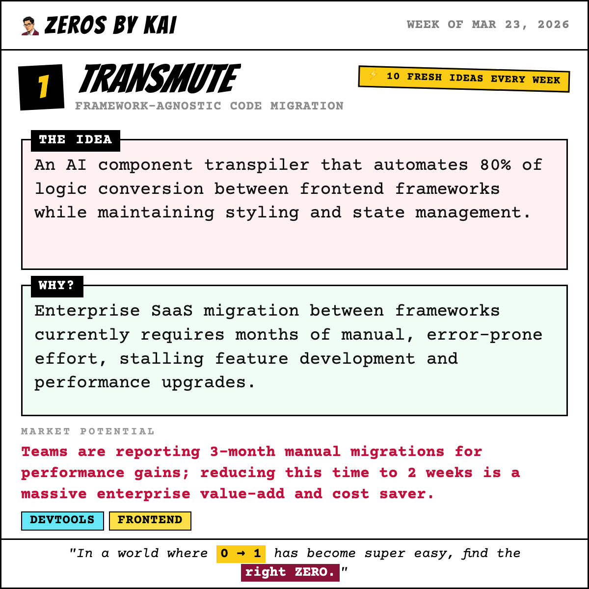
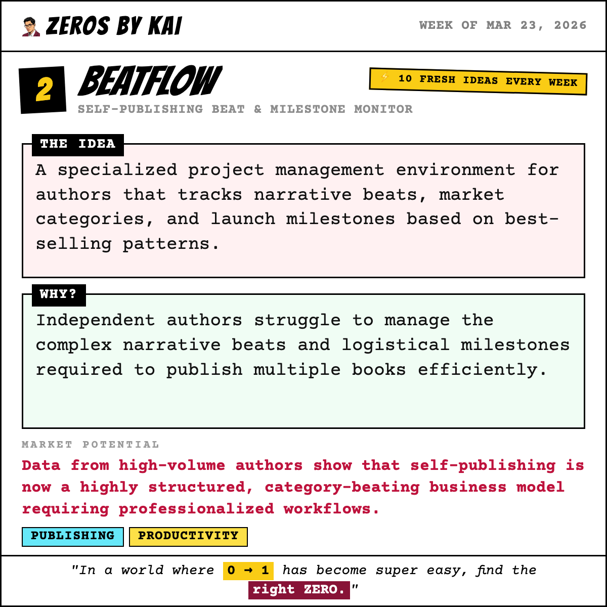
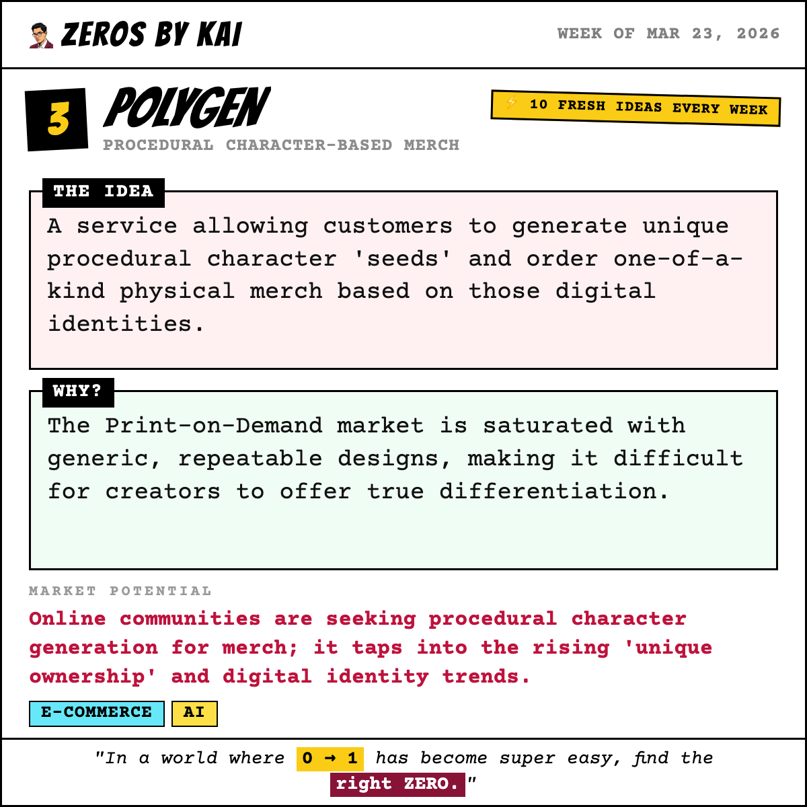
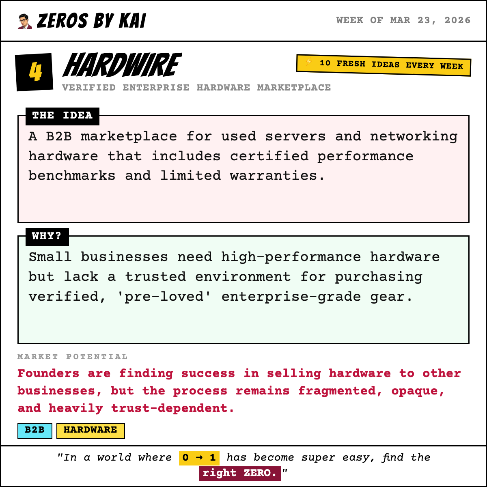
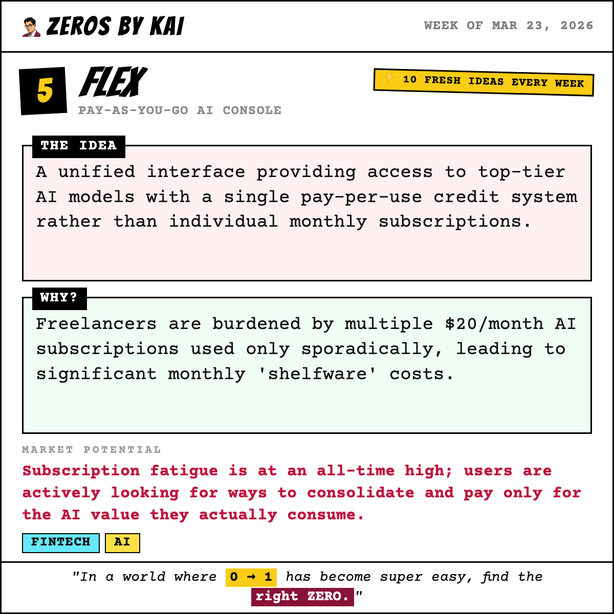
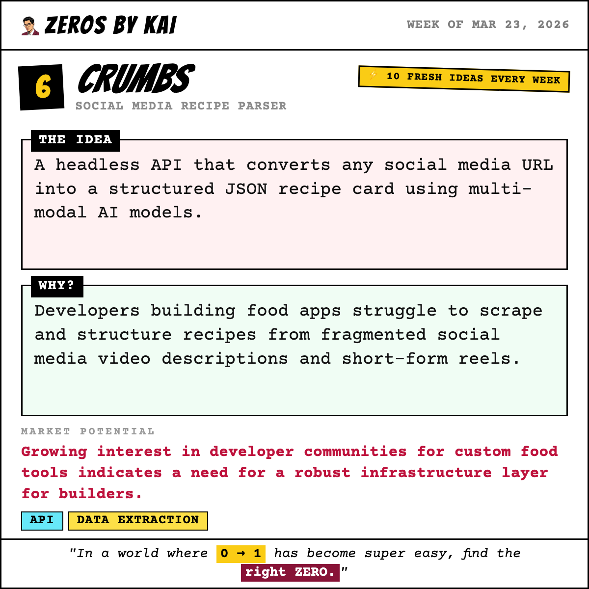
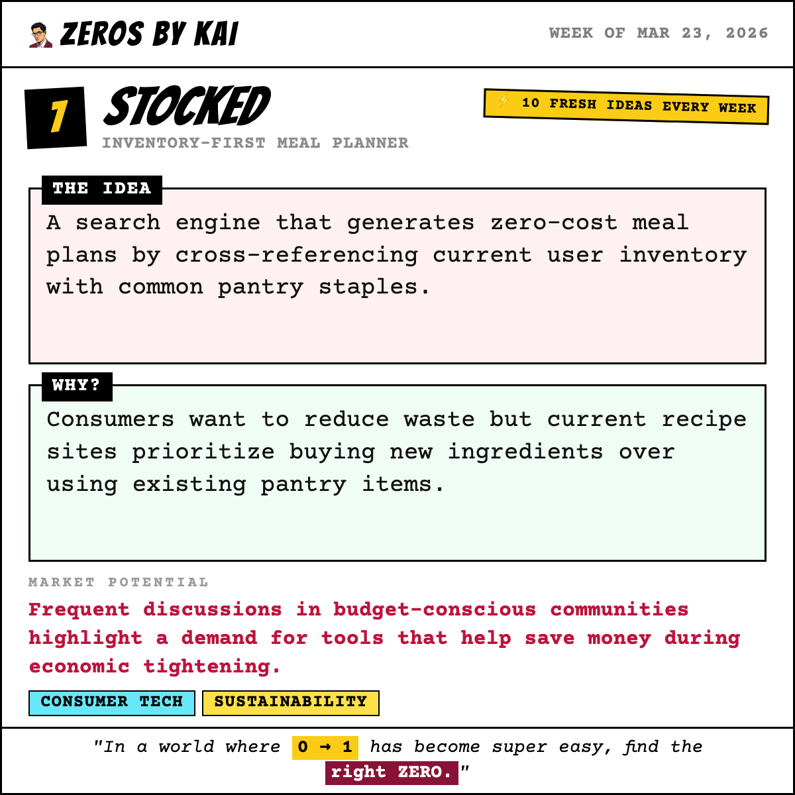
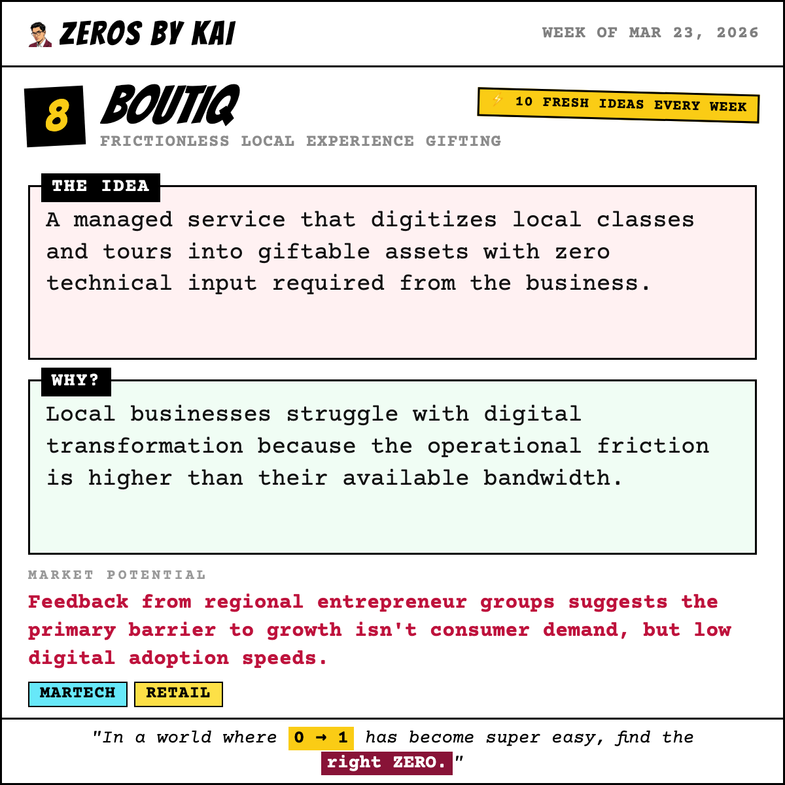
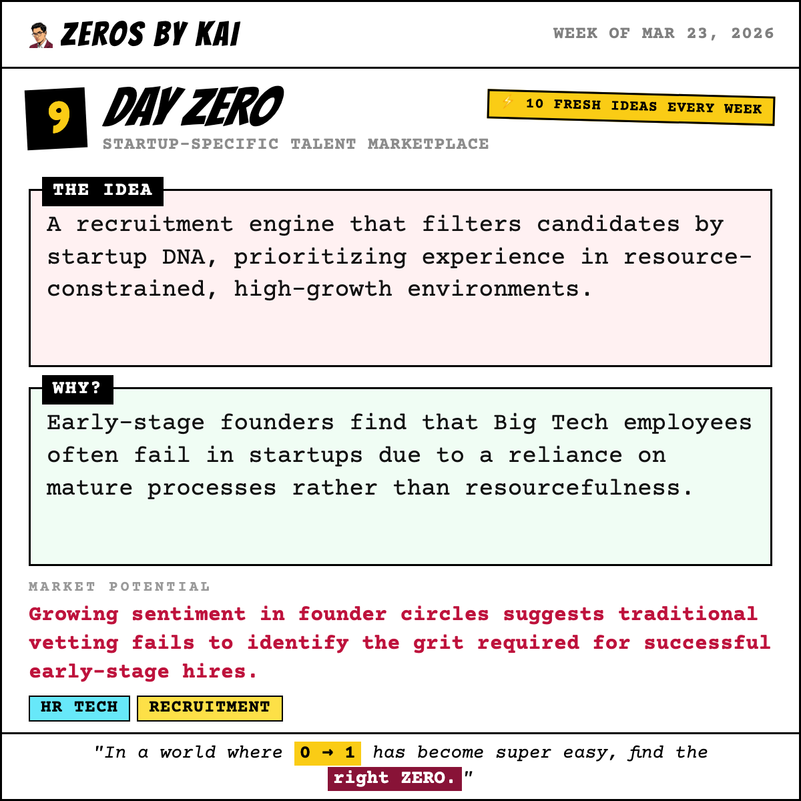
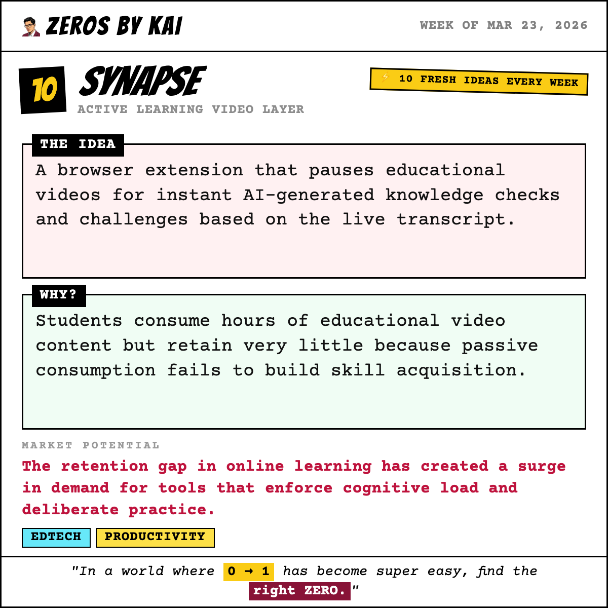

# 🐦 X Post Gallery - 2026-03-23T17:00:00.000Z

This file provides a preview of all generated posts. You can copy-paste the text directly into X.

---

## 🕒 Scheduled: 2026-03-23T17:00:00.000Z

### 📝 Tweet Text:
```text
💡 Week of Mar 23, 2026 — Startup Idea #1 of the week.

Transmute: Framework-Agnostic Code Migration

The Idea:
An AI component transpiler that automates 80% of logic conversion between frontend frameworks while maintaining styling and state management.

Why:
Enterprise SaaS migration between frameworks currently requires months of manual, error-prone effort, stalling feature development and performance upgrades.

Market Potential:
Teams are reporting 3-month manual migrations for performance gains; reducing this time to 2 weeks is a massive enterprise value-add and cost saver.

Who it's for: Frontend leads and CTOs

Would you build this? Vote for your favourite idea this week → zerosbykai.com

#startup #devtools #frontend #buildinpublic #indiehacker #startupideas #entrepreneurship #sideproject
```

### 🖼️ Image Preview:


---

## 🕒 Scheduled: 2026-03-24T14:00:00.000Z

### 📝 Tweet Text:
```text
💡 Week of Mar 23, 2026 — Startup Idea #2 of the week.

Beatflow: Self-Publishing Beat & Milestone Monitor

The Idea:
A specialized project management environment for authors that tracks narrative beats, market categories, and launch milestones based on best-selling patterns.

Why:
Independent authors struggle to manage the complex narrative beats and logistical milestones required to publish multiple books efficiently.

Market Potential:
Data from high-volume authors show that self-publishing is now a highly structured, category-beating business model requiring professionalized workflows.

Who it's for: Independent authors and author-preneurs

Would you build this? Vote for your favourite idea this week → zerosbykai.com

#startup #publishing #productivity #buildinpublic #indiehacker #startupideas #entrepreneurship #sideproject
```

### 🖼️ Image Preview:


---

## 🕒 Scheduled: 2026-03-25T14:00:00.000Z

### 📝 Tweet Text:
```text
💡 Week of Mar 23, 2026 — Startup Idea #3 of the week.

Polygen: Procedural Character-Based Merch

The Idea:
A service allowing customers to generate unique procedural character 'seeds' and order one-of-a-kind physical merch based on those digital identities.

Why:
The Print-on-Demand market is saturated with generic, repeatable designs, making it difficult for creators to offer true differentiation.

Market Potential:
Online communities are seeking procedural character generation for merch; it taps into the rising 'unique ownership' and digital identity trends.

Who it's for: Anime fans and digital collectors

Would you build this? Vote for your favourite idea this week → zerosbykai.com

#startup #e-commerce #ai #buildinpublic #indiehacker #startupideas #entrepreneurship #sideproject
```

### 🖼️ Image Preview:


---

## 🕒 Scheduled: 2026-03-26T14:00:00.000Z

### 📝 Tweet Text:
```text
💡 Week of Mar 23, 2026 — Startup Idea #4 of the week.

Hardwire: Verified Enterprise Hardware Marketplace

The Idea:
A B2B marketplace for used servers and networking hardware that includes certified performance benchmarks and limited warranties.

Why:
Small businesses need high-performance hardware but lack a trusted environment for purchasing verified, 'pre-loved' enterprise-grade gear.

Market Potential:
Founders are finding success in selling hardware to other businesses, but the process remains fragmented, opaque, and heavily trust-dependent.

Who it's for: Self-hosting startups and IT firms

Would you build this? Vote for your favourite idea this week → zerosbykai.com

#startup #b2b #hardware #buildinpublic #indiehacker #startupideas #entrepreneurship #sideproject
```

### 🖼️ Image Preview:


---

## 🕒 Scheduled: 2026-03-27T14:00:00.000Z

### 📝 Tweet Text:
```text
💡 Week of Mar 23, 2026 — Startup Idea #5 of the week.

Flex: Pay-As-You-Go AI Console

The Idea:
A unified interface providing access to top-tier AI models with a single pay-per-use credit system rather than individual monthly subscriptions.

Why:
Freelancers are burdened by multiple $20/month AI subscriptions used only sporadically, leading to significant monthly 'shelfware' costs.

Market Potential:
Subscription fatigue is at an all-time high; users are actively looking for ways to consolidate and pay only for the AI value they actually consume.

Who it's for: Freelancers and solo developers

Would you build this? Vote for your favourite idea this week → zerosbykai.com

#startup #fintech #ai #buildinpublic #indiehacker #startupideas #entrepreneurship #sideproject
```

### 🖼️ Image Preview:


---

## 🕒 Scheduled: 2026-03-28T15:00:00.000Z

### 📝 Tweet Text:
```text
💡 Week of Mar 23, 2026 — Startup Idea #6 of the week.

Crumbs: Social Media Recipe Parser

The Idea:
A headless API that converts any social media URL into a structured JSON recipe card using multi-modal AI models.

Why:
Developers building food apps struggle to scrape and structure recipes from fragmented social media video descriptions and short-form reels.

Market Potential:
Growing interest in developer communities for custom food tools indicates a need for a robust infrastructure layer for builders.

Who it's for: Developers building health, fitness, and cooking applications.

Would you build this? Vote for your favourite idea this week → zerosbykai.com

#startup #api #dataextraction #buildinpublic #indiehacker #startupideas #entrepreneurship #sideproject
```

### 🖼️ Image Preview:


---

## 🕒 Scheduled: 2026-03-29T15:00:00.000Z

### 📝 Tweet Text:
```text
💡 Week of Mar 23, 2026 — Startup Idea #7 of the week.

Stocked: Inventory-First Meal Planner

The Idea:
A search engine that generates zero-cost meal plans by cross-referencing current user inventory with common pantry staples.

Why:
Consumers want to reduce waste but current recipe sites prioritize buying new ingredients over using existing pantry items.

Market Potential:
Frequent discussions in budget-conscious communities highlight a demand for tools that help save money during economic tightening.

Who it's for: Budget-conscious households and students.

Would you build this? Vote for your favourite idea this week → zerosbykai.com

#startup #consumertech #sustainability #buildinpublic #indiehacker #startupideas #entrepreneurship #sideproject
```

### 🖼️ Image Preview:


---

## 🕒 Scheduled: 2026-03-30T13:00:00.000Z

### 📝 Tweet Text:
```text
💡 Week of Mar 23, 2026 — Startup Idea #8 of the week.

Boutiq: Frictionless Local Experience Gifting

The Idea:
A managed service that digitizes local classes and tours into giftable assets with zero technical input required from the business.

Why:
Local businesses struggle with digital transformation because the operational friction is higher than their available bandwidth.

Market Potential:
Feedback from regional entrepreneur groups suggests the primary barrier to growth isn't consumer demand, but low digital adoption speeds.

Who it's for: Local experience-based businesses like workshops and tours.

Would you build this? Vote for your favourite idea this week → zerosbykai.com

#startup #martech #retail #buildinpublic #indiehacker #startupideas #entrepreneurship #sideproject
```

### 🖼️ Image Preview:


---

## 🕒 Scheduled: 2026-03-31T14:00:00.000Z

### 📝 Tweet Text:
```text
💡 Week of Mar 23, 2026 — Startup Idea #9 of the week.

Day Zero: Startup-Specific Talent Marketplace

The Idea:
A recruitment engine that filters candidates by startup DNA, prioritizing experience in resource-constrained, high-growth environments.

Why:
Early-stage founders find that Big Tech employees often fail in startups due to a reliance on mature processes rather than resourcefulness.

Market Potential:
Growing sentiment in founder circles suggests traditional vetting fails to identify the grit required for successful early-stage hires.

Who it's for: Seed to Series A founders hiring early employees.

Would you build this? Vote for your favourite idea this week → zerosbykai.com

#startup #hrtech #recruitment #buildinpublic #indiehacker #startupideas #entrepreneurship #sideproject
```

### 🖼️ Image Preview:


---

## 🕒 Scheduled: 2026-04-01T14:00:00.000Z

### 📝 Tweet Text:
```text
💡 Week of Mar 23, 2026 — Startup Idea #10 of the week.

Synapse: Active Learning Video Layer

The Idea:
A browser extension that pauses educational videos for instant AI-generated knowledge checks and challenges based on the live transcript.

Why:
Students consume hours of educational video content but retain very little because passive consumption fails to build skill acquisition.

Market Potential:
The retention gap in online learning has created a surge in demand for tools that enforce cognitive load and deliberate practice.

Who it's for: Self-taught developers and online students.

Would you build this? Vote for your favourite idea this week → zerosbykai.com

#startup #edtech #productivity #buildinpublic #indiehacker #startupideas #entrepreneurship #sideproject
```

### 🖼️ Image Preview:


---

