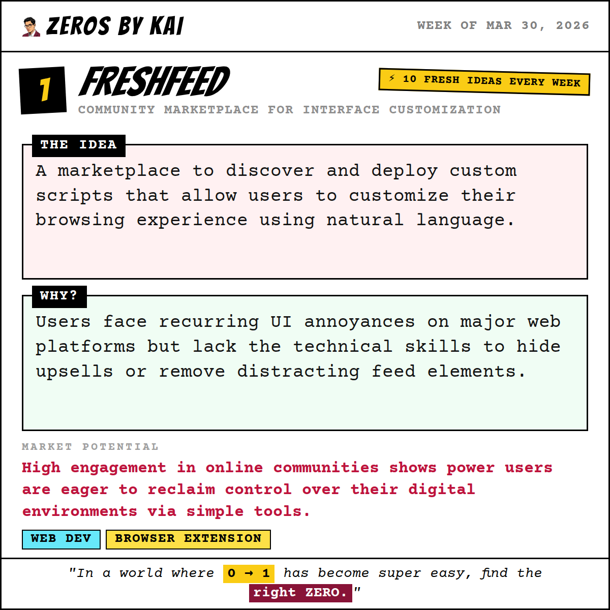
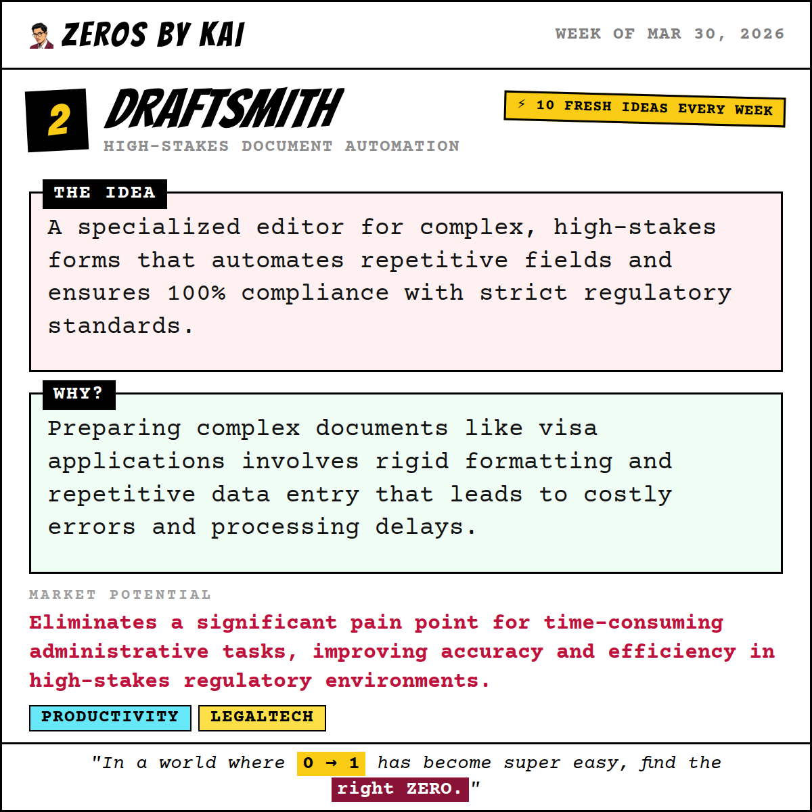
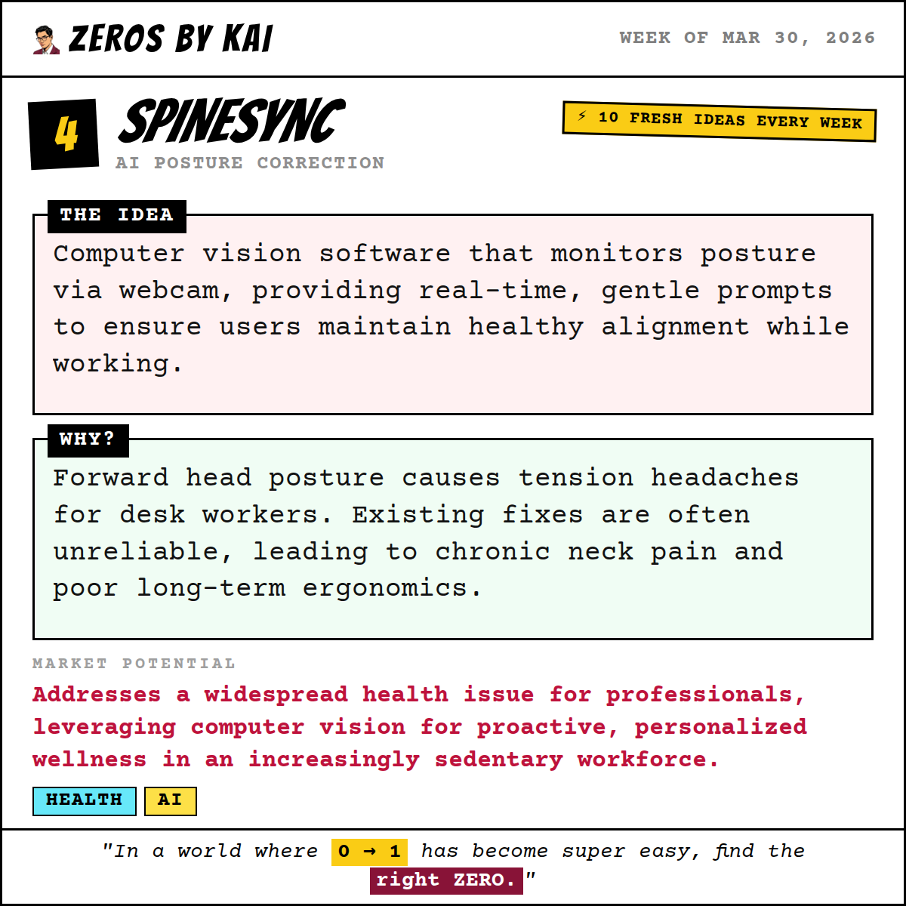
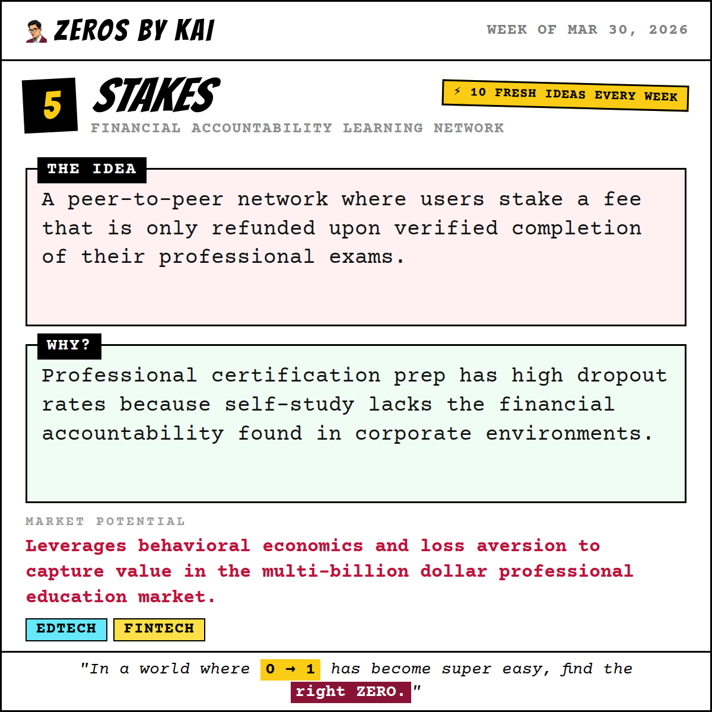
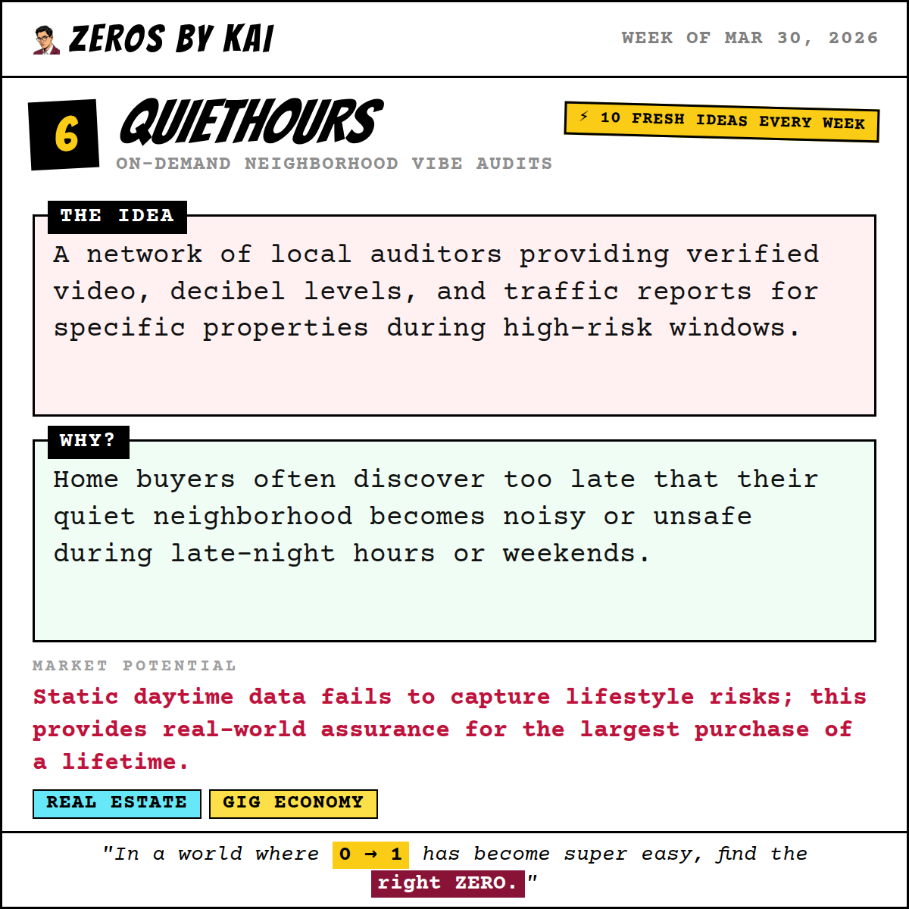
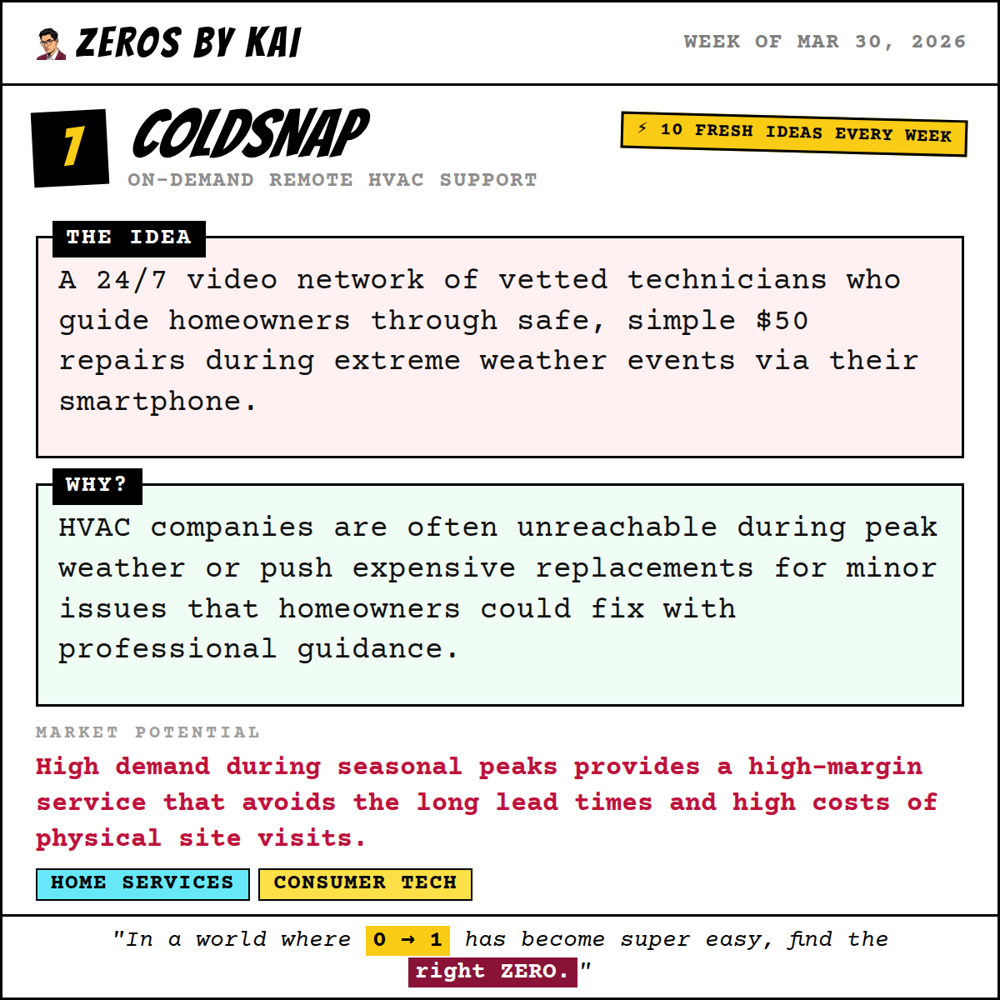
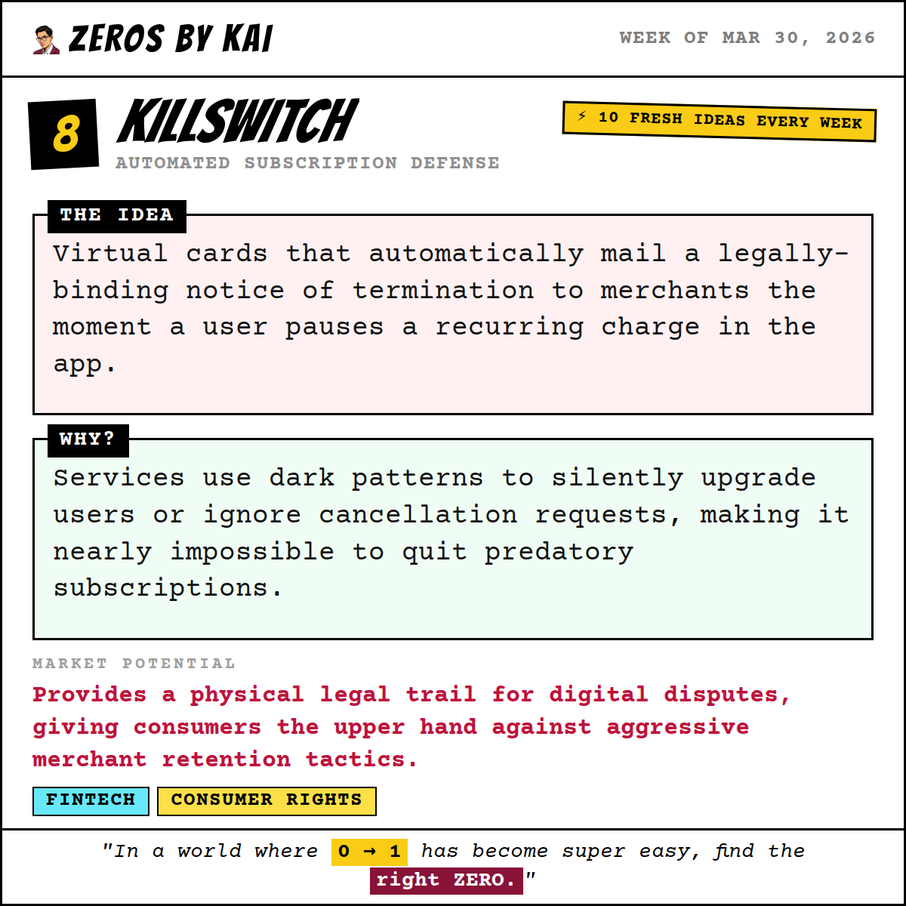
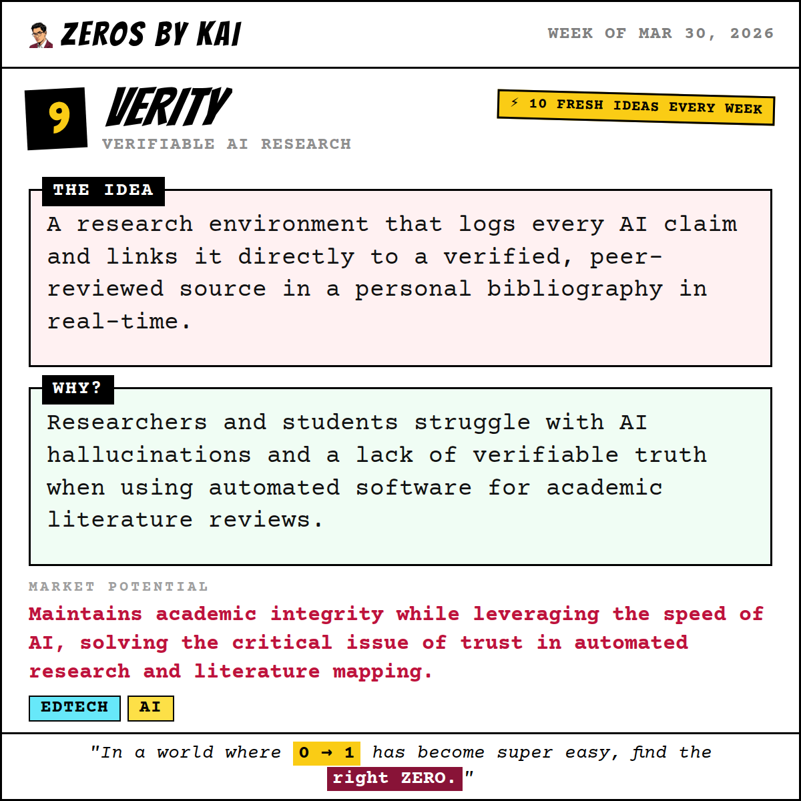
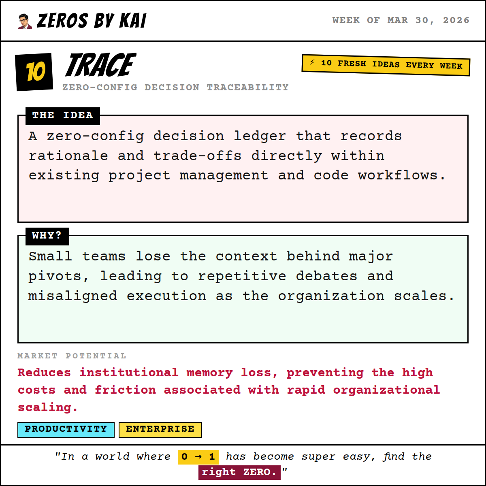

# 🐦 X Post Gallery - 2026-03-30T17:00:00.000Z

This file provides a preview of all generated posts. You can copy-paste the text directly into X.

---

## 🕒 Scheduled: 2026-03-30T17:00:00.000Z

### 📝 Tweet Text:
```text
💡 Week of Mar 30, 2026 — Startup Idea #1 of the week.

FreshFeed: Community Marketplace for Interface Customization

The Idea:
A marketplace to discover and deploy custom scripts that allow users to customize their browsing experience using natural language.

Why:
Users face recurring UI annoyances on major web platforms but lack the technical skills to hide upsells or remove distracting feed elements.

Market Potential:
High engagement in online communities shows power users are eager to reclaim control over their digital environments via simple tools.

Who it's for: Platform power users

Would you build this? Vote for your favourite idea this week → zerosbykai.com

#startup #webdev #browserextension #buildinpublic #indiehacker #startupideas #entrepreneurship #sideproject
```

### 🖼️ Image Preview:


---

## 🕒 Scheduled: 2026-03-31T14:00:00.000Z

### 📝 Tweet Text:
```text
💡 Week of Mar 30, 2026 — Startup Idea #2 of the week.

Draftsmith: High-Stakes Document Automation

The Idea:
A specialized editor for complex, high-stakes forms that automates repetitive fields and ensures 100% compliance with strict regulatory standards.

Why:
Preparing complex documents like visa applications involves rigid formatting and repetitive data entry that leads to costly errors and processing delays.

Market Potential:
Eliminates a significant pain point for time-consuming administrative tasks, improving accuracy and efficiency in high-stakes regulatory environments.

Who it's for: Immigration and legal professionals

Would you build this? Vote for your favourite idea this week → zerosbykai.com

#startup #productivity #legaltech #buildinpublic #indiehacker #startupideas #entrepreneurship #sideproject
```

### 🖼️ Image Preview:


---

## 🕒 Scheduled: 2026-04-01T14:00:00.000Z

### 📝 Tweet Text:
```text
💡 Week of Mar 30, 2026 — Startup Idea #3 of the week.

HardCode: Interview Assessment for AI-Assisted Coders

The Idea:
An assessment engine that dynamically challenges candidates to apply core logic with and without the assistance of AI tools.

Why:
Technical interviews are increasingly gamed by LLMs, making it difficult to assess a candidate's true foundational computer science depth.

Market Potential:
Ensures engineering quality in an AI-augmented world, preventing long-term technical debt and expensive hiring mistakes.

Who it's for: Engineering hiring managers

Would you build this? Vote for your favourite idea this week → zerosbykai.com

#startup #hrtech #ai #buildinpublic #indiehacker #startupideas #entrepreneurship #sideproject
```

### 🖼️ Image Preview:


---

## 🕒 Scheduled: 2026-04-02T14:00:00.000Z

### 📝 Tweet Text:
```text
💡 Week of Mar 30, 2026 — Startup Idea #4 of the week.

SpineSync: AI Posture Correction

The Idea:
Computer vision software that monitors posture via webcam, providing real-time, gentle prompts to ensure users maintain healthy alignment while working.

Why:
Forward head posture causes tension headaches for desk workers. Existing fixes are often unreliable, leading to chronic neck pain and poor long-term ergonomics.

Market Potential:
Addresses a widespread health issue for professionals, leveraging computer vision for proactive, personalized wellness in an increasingly sedentary workforce.

Who it's for: Remote desk workers

Would you build this? Vote for your favourite idea this week → zerosbykai.com

#startup #health #ai #buildinpublic #indiehacker #startupideas #entrepreneurship #sideproject
```

### 🖼️ Image Preview:


---

## 🕒 Scheduled: 2026-04-03T14:00:00.000Z

### 📝 Tweet Text:
```text
💡 Week of Mar 30, 2026 — Startup Idea #5 of the week.

Stakes: Financial Accountability Learning Network

The Idea:
A peer-to-peer network where users stake a fee that is only refunded upon verified completion of their professional exams.

Why:
Professional certification prep has high dropout rates because self-study lacks the financial accountability found in corporate environments.

Market Potential:
Leverages behavioral economics and loss aversion to capture value in the multi-billion dollar professional education market.

Who it's for: Independent certification candidates

Would you build this? Vote for your favourite idea this week → zerosbykai.com

#startup #edtech #fintech #buildinpublic #indiehacker #startupideas #entrepreneurship #sideproject
```

### 🖼️ Image Preview:


---

## 🕒 Scheduled: 2026-04-04T15:00:00.000Z

### 📝 Tweet Text:
```text
💡 Week of Mar 30, 2026 — Startup Idea #6 of the week.

QuietHours: On-Demand Neighborhood Vibe Audits

The Idea:
A network of local auditors providing verified video, decibel levels, and traffic reports for specific properties during high-risk windows.

Why:
Home buyers often discover too late that their quiet neighborhood becomes noisy or unsafe during late-night hours or weekends.

Market Potential:
Static daytime data fails to capture lifestyle risks; this provides real-world assurance for the largest purchase of a lifetime.

Who it's for: Out-of-state home buyers

Would you build this? Vote for your favourite idea this week → zerosbykai.com

#startup #realestate #gigeconomy #buildinpublic #indiehacker #startupideas #entrepreneurship #sideproject
```

### 🖼️ Image Preview:


---

## 🕒 Scheduled: 2026-04-05T15:00:00.000Z

### 📝 Tweet Text:
```text
💡 Week of Mar 30, 2026 — Startup Idea #7 of the week.

ColdSnap: On-Demand Remote HVAC Support

The Idea:
A 24/7 video network of vetted technicians who guide homeowners through safe, simple $50 repairs during extreme weather events via their smartphone.

Why:
HVAC companies are often unreachable during peak weather or push expensive replacements for minor issues that homeowners could fix with professional guidance.

Market Potential:
High demand during seasonal peaks provides a high-margin service that avoids the long lead times and high costs of physical site visits.

Who it's for: Budget-conscious homeowners

Would you build this? Vote for your favourite idea this week → zerosbykai.com

#startup #homeservices #consumertech #buildinpublic #indiehacker #startupideas #entrepreneurship #sideproject
```

### 🖼️ Image Preview:


---

## 🕒 Scheduled: 2026-04-06T13:00:00.000Z

### 📝 Tweet Text:
```text
💡 Week of Mar 30, 2026 — Startup Idea #8 of the week.

Killswitch: Automated Subscription Defense

The Idea:
Virtual cards that automatically mail a legally-binding notice of termination to merchants the moment a user pauses a recurring charge in the app.

Why:
Services use dark patterns to silently upgrade users or ignore cancellation requests, making it nearly impossible to quit predatory subscriptions.

Market Potential:
Provides a physical legal trail for digital disputes, giving consumers the upper hand against aggressive merchant retention tactics.

Who it's for: Subscription-heavy consumers

Would you build this? Vote for your favourite idea this week → zerosbykai.com

#startup #fintech #consumerrights #buildinpublic #indiehacker #startupideas #entrepreneurship #sideproject
```

### 🖼️ Image Preview:


---

## 🕒 Scheduled: 2026-04-07T14:00:00.000Z

### 📝 Tweet Text:
```text
💡 Week of Mar 30, 2026 — Startup Idea #9 of the week.

Verity: Verifiable AI Research

The Idea:
A research environment that logs every AI claim and links it directly to a verified, peer-reviewed source in a personal bibliography in real-time.

Why:
Researchers and students struggle with AI hallucinations and a lack of verifiable truth when using automated software for academic literature reviews.

Market Potential:
Maintains academic integrity while leveraging the speed of AI, solving the critical issue of trust in automated research and literature mapping.

Who it's for: Academic researchers

Would you build this? Vote for your favourite idea this week → zerosbykai.com

#startup #edtech #ai #buildinpublic #indiehacker #startupideas #entrepreneurship #sideproject
```

### 🖼️ Image Preview:


---

## 🕒 Scheduled: 2026-04-08T14:00:00.000Z

### 📝 Tweet Text:
```text
💡 Week of Mar 30, 2026 — Startup Idea #10 of the week.

Trace: Zero-Config Decision Traceability

The Idea:
A zero-config decision ledger that records rationale and trade-offs directly within existing project management and code workflows.

Why:
Small teams lose the context behind major pivots, leading to repetitive debates and misaligned execution as the organization scales.

Market Potential:
Reduces institutional memory loss, preventing the high costs and friction associated with rapid organizational scaling.

Who it's for: High-growth engineering teams

Would you build this? Vote for your favourite idea this week → zerosbykai.com

#startup #productivity #enterprise #buildinpublic #indiehacker #startupideas #entrepreneurship #sideproject
```

### 🖼️ Image Preview:


---

