# 🐦 X Post Gallery - 2026-04-06T14:30:00.000Z

This file provides a preview of all generated posts. You can copy-paste the text directly into X.

---

## 🕒 Scheduled: 2026-04-06T14:30:00.000Z

### 📝 Tweet Text:
```text
🏆 Last week's winner is in.

The ZerosByKai community voted — and the startup idea that got the most votes this week was:

Draftsmith — High-Stakes Document Automation

The Idea:
A specialized editor for complex, high-stakes forms that automates repetitive fields and ensures 100% compliance with strict regulatory standards.

Why:
Preparing complex documents like visa applications involves rigid formatting and repetitive data entry that leads to costly errors and processing delays.

The community saw the opportunity. Do you?

🆕 10 brand-new startup ideas just dropped today. One of them could be the next big thing.

Vote for your favourite → zerosbykai.com

#startup #buildinpublic #indiehacker #startupideas #entrepreneurship #sideproject #saas
```

### 🖼️ Image Preview:
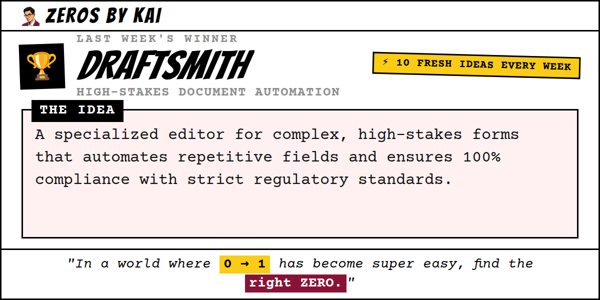

---

## 🕒 Scheduled: 2026-04-06T17:00:00.000Z

### 📝 Tweet Text:
```text
💡 Week of Apr 6, 2026 — Startup Idea #1 of the week.

Sentry: Unauthorized Certificate Monitor

The Idea:
A lightweight system utility that alerts users the moment a new root certificate is added to the trusted store by third-party software installers.

Why:
Consumer software occasionally installs hidden root CAs or TLS backdoors, creating massive security vulnerabilities without the user's knowledge.

Market Potential:
Fills a critical gap in OS security notifications for a common but obscure vector of corporate and malicious surveillance.

Who it's for: Cybersecurity professionals

Would you build this? Vote for your favourite idea this week → zerosbykai.com

#startup #cybersecurity #privacy #buildinpublic #indiehacker #startupideas #entrepreneurship #sideproject
```

### 🖼️ Image Preview:
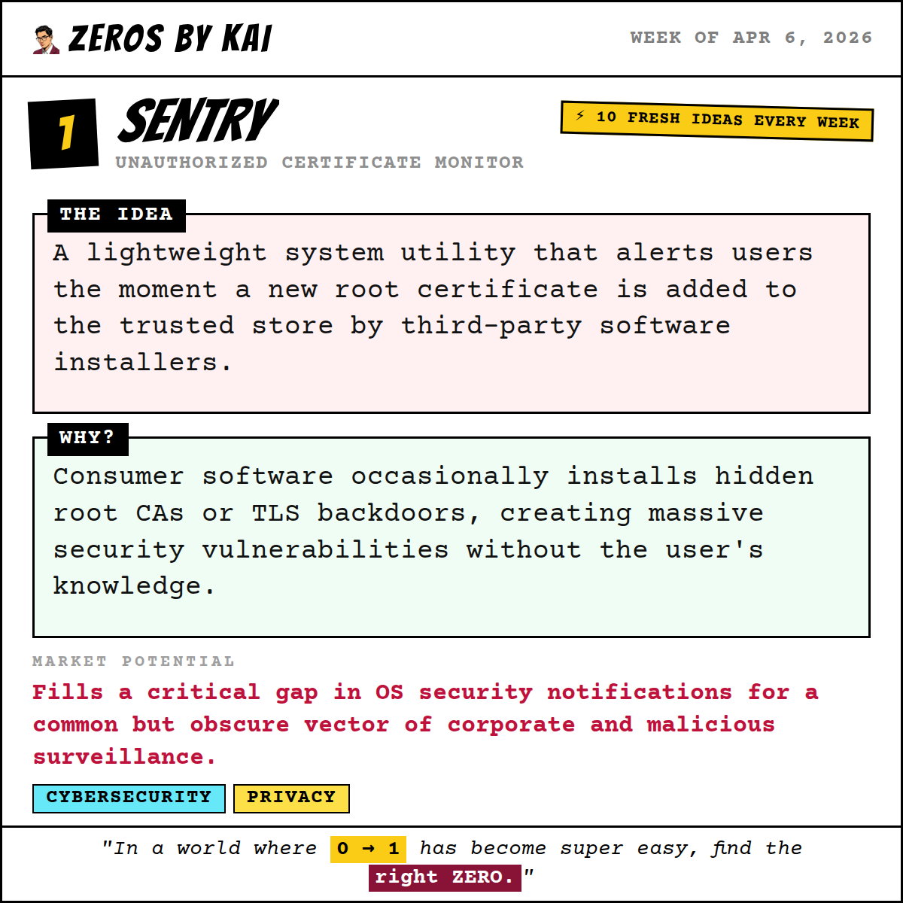

---

## 🕒 Scheduled: 2026-04-07T14:00:00.000Z

### 📝 Tweet Text:
```text
💡 Week of Apr 6, 2026 — Startup Idea #2 of the week.

Vouch: Informal Transaction Credit Scoring

The Idea:
A scoring engine that translates daily digital wallet transactions into a 'trust score' for micro-lenders to approve business loans.

Why:
Micro-entrepreneurs in emerging markets lack formal balance sheets, preventing them from accessing business loans despite high sales volumes.

Market Potential:
Unlocks capital for the world's largest unbanked workforce using their existing digital footprint.

Who it's for: Street vendors and small artisans

Would you build this? Vote for your favourite idea this week → zerosbykai.com

#startup #fintech #lending #buildinpublic #indiehacker #startupideas #entrepreneurship #sideproject
```

### 🖼️ Image Preview:
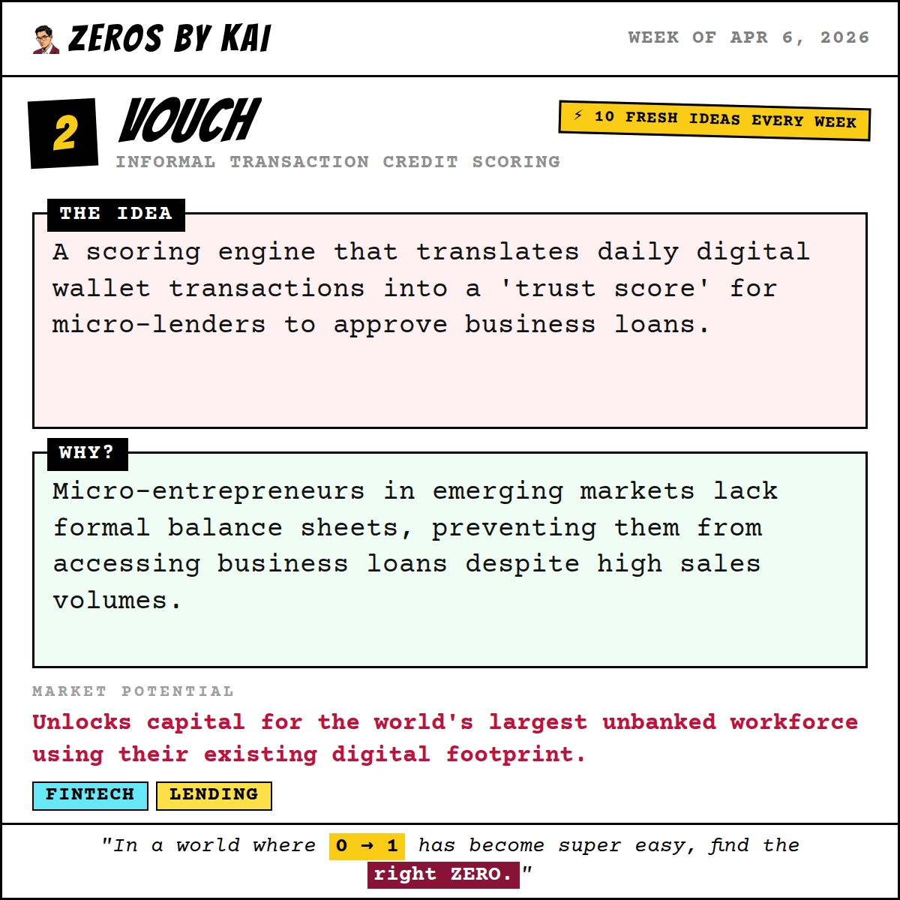

---

## 🕒 Scheduled: 2026-04-08T14:00:00.000Z

### 📝 Tweet Text:
```text
💡 Week of Apr 6, 2026 — Startup Idea #3 of the week.

Keep: Neighborhood Secure Cold Storage

The Idea:
A network of biometric-access micro-lockers located in local convenience stores, providing secure physical storage near residential hubs.

Why:
Urban residents have no convenient way to store physical backups, sensitive documents, or high-value small items with instant proximity to home.

Market Potential:
Provides a physical security layer for the digital age, treating physical assets with the security of a bank vault and the speed of a locker.

Who it's for: Privacy-conscious urban professionals

Would you build this? Vote for your favourite idea this week → zerosbykai.com

#startup #security #realestate #buildinpublic #indiehacker #startupideas #entrepreneurship #sideproject
```

### 🖼️ Image Preview:
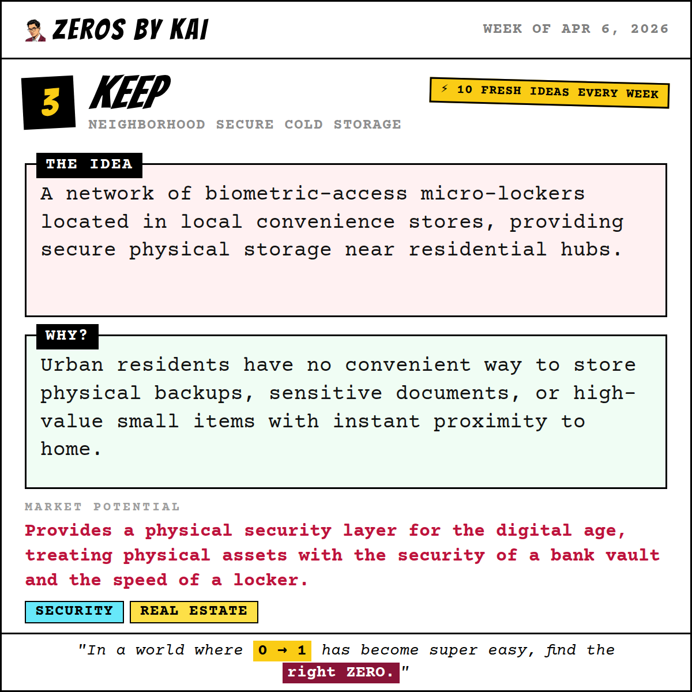

---

## 🕒 Scheduled: 2026-04-09T14:00:00.000Z

### 📝 Tweet Text:
```text
💡 Week of Apr 6, 2026 — Startup Idea #4 of the week.

Paper Route: Hyper-Local Bookstore Delivery

The Idea:
A micro-logistics network connecting shops to neighborhood couriers for one-hour delivery, utilizing local retail hubs as fulfillment points.

Why:
Local bookstores lose customers to e-commerce giants because they lack delivery infrastructure for residents wanting same-day home convenience.

Market Potential:
Restores competitiveness to local retail while serving the demand for instant gratification without supporting monopolies.

Who it's for: Local book lovers and shop owners

Would you build this? Vote for your favourite idea this week → zerosbykai.com

#startup #logistics #retail #buildinpublic #indiehacker #startupideas #entrepreneurship #sideproject
```

### 🖼️ Image Preview:
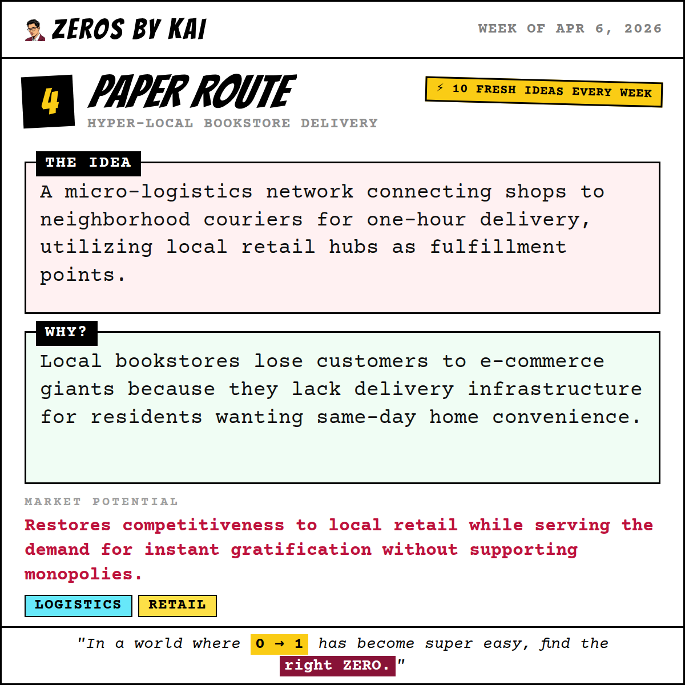

---

## 🕒 Scheduled: 2026-04-10T14:00:00.000Z

### 📝 Tweet Text:
```text
💡 Week of Apr 6, 2026 — Startup Idea #5 of the week.

Lobby: Automated Concierge for Small Lodgings

The Idea:
A QR-based physical room hub that automates common guest requests and local logistics without requiring a 24/7 front desk.

Why:
Small hotel owners are overwhelmed by repetitive guest inquiries and check-in logistics, leading to burnout and poor service reviews.

Market Potential:
Professionalizes small-scale hospitality while significantly reducing labor costs and owner fatigue.

Who it's for: Boutique hotel owners and hosts

Would you build this? Vote for your favourite idea this week → zerosbykai.com

#startup #hospitality #automation #buildinpublic #indiehacker #startupideas #entrepreneurship #sideproject
```

### 🖼️ Image Preview:
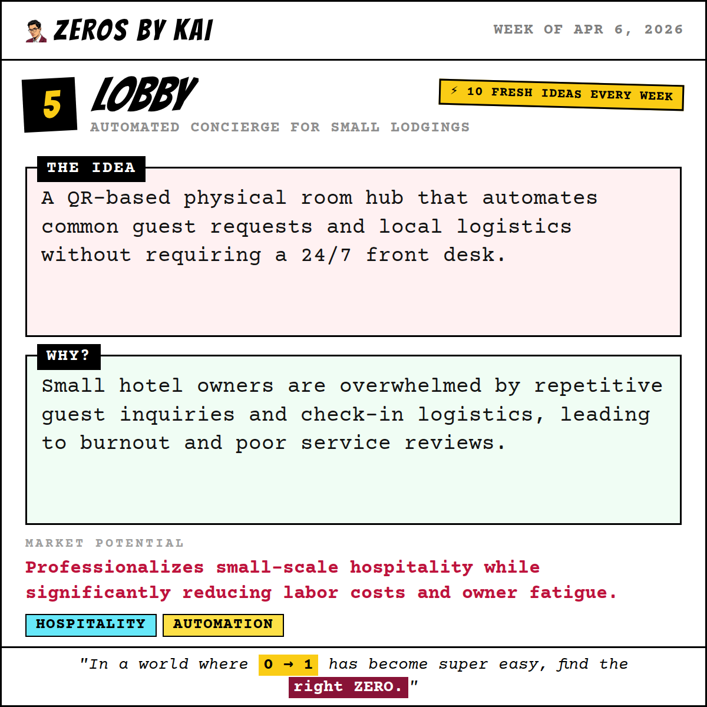

---

## 🕒 Scheduled: 2026-04-11T15:00:00.000Z

### 📝 Tweet Text:
```text
💡 Week of Apr 6, 2026 — Startup Idea #6 of the week.

Onward: Independent Rental and Travel Verification

The Idea:
A third-party audit app providing time-stamped vehicle reports and 48-hour flight reservations to ensure compliance and shut down fraudulent claims.

Why:
Travelers face fraudulent rental damage claims and entry denials at borders due to a lack of certified condition reports or proof of onward travel.

Market Potential:
Reduces high-stress financial risks for travelers by providing an objective, third-party truth for disputes and bureaucracy.

Who it's for: International backpackers and car renters

Would you build this? Vote for your favourite idea this week → zerosbykai.com

#startup #travel #fintech #buildinpublic #indiehacker #startupideas #entrepreneurship #sideproject
```

### 🖼️ Image Preview:
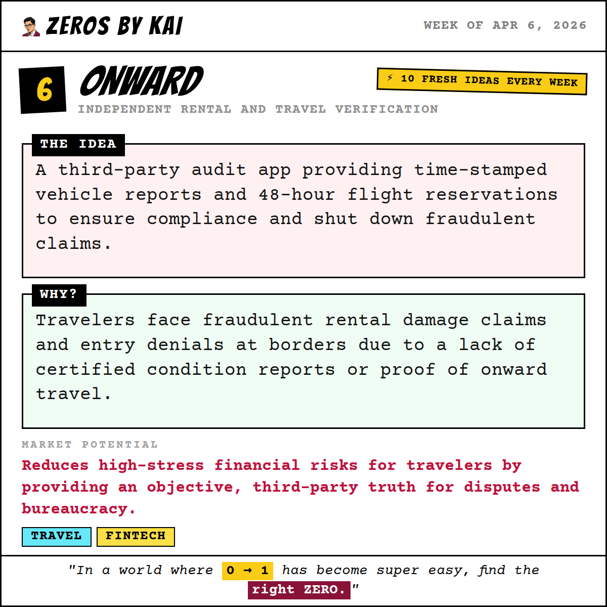

---

## 🕒 Scheduled: 2026-04-12T15:00:00.000Z

### 📝 Tweet Text:
```text
💡 Week of Apr 6, 2026 — Startup Idea #7 of the week.

Garage: Localized High-End Tool Repositories

The Idea:
Automated, insurance-integrated tool libraries that use smart-locks to manage peer-to-peer sharing of expensive hardware in local neighborhoods.

Why:
High-end tools sit idle in individual garages while others avoid starting projects due to high equipment entry costs and lack of space.

Market Potential:
Reduces waste and entry barriers for creators while allowing tool owners to monetize their underused physical assets.

Who it's for: DIY enthusiasts and urban hobbyists

Would you build this? Vote for your favourite idea this week → zerosbykai.com

#startup #sharingeconomy #diy #buildinpublic #indiehacker #startupideas #entrepreneurship #sideproject
```

### 🖼️ Image Preview:
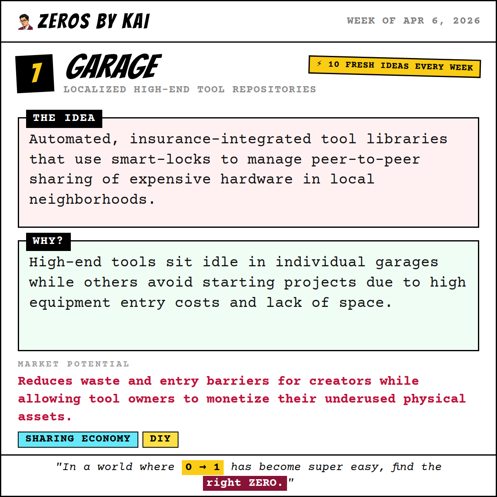

---

## 🕒 Scheduled: 2026-04-13T13:00:00.000Z

### 📝 Tweet Text:
```text
💡 Week of Apr 6, 2026 — Startup Idea #8 of the week.

Ohm: Granular Home Utility Attribution

The Idea:
Non-invasive, clamp-on sensors that use signature recognition to break down water and power usage by individual appliance.

Why:
Homeowners experience 'bill shock' but cannot identify which specific appliance or behavior is driving high utility costs in real-time.

Market Potential:
Transforms a vague monthly expense into actionable data, leading to direct cost savings and reduced environmental impact.

Who it's for: Eco-conscious homeowners

Would you build this? Vote for your favourite idea this week → zerosbykai.com

#startup #sustainability #home #buildinpublic #indiehacker #startupideas #entrepreneurship #sideproject
```

### 🖼️ Image Preview:
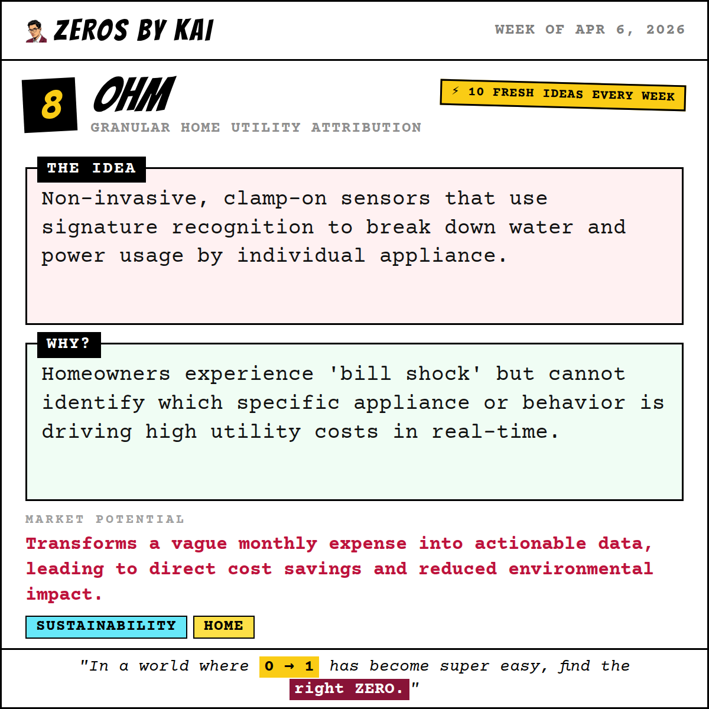

---

## 🕒 Scheduled: 2026-04-14T14:00:00.000Z

### 📝 Tweet Text:
```text
💡 Week of Apr 6, 2026 — Startup Idea #9 of the week.

Puremark: Clean-Label Supply Chain Verification

The Idea:
A physical verification mark and audit service using batch-testing and facility inspections to certify snack brands as truly additive-free.

Why:
Snack consumers face high anxiety over hidden additives, making it difficult for honest new brands to prove they use only kitchen-standard ingredients.

Market Potential:
Builds high-integrity trust in a saturated market where 'natural' labels are increasingly ignored by consumers.

Who it's for: Health-conscious parents

Would you build this? Vote for your favourite idea this week → zerosbykai.com

#startup #food #trust #buildinpublic #indiehacker #startupideas #entrepreneurship #sideproject
```

### 🖼️ Image Preview:
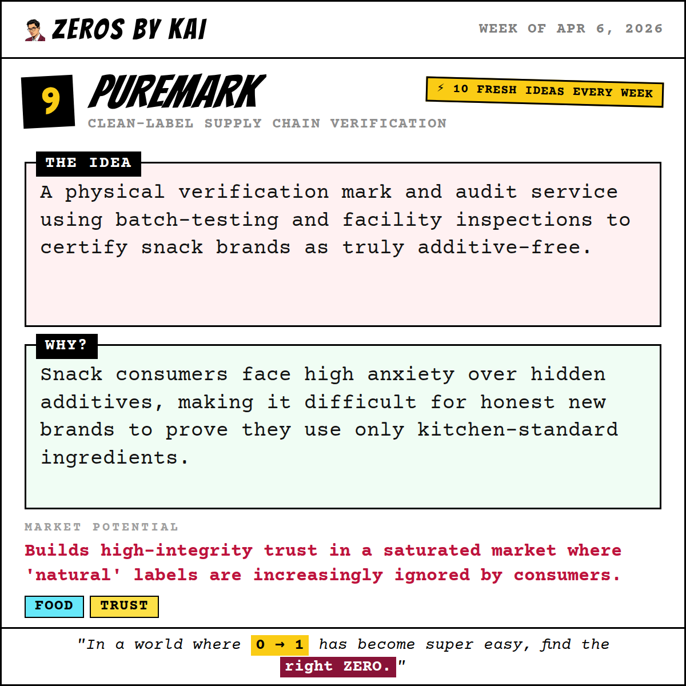

---

## 🕒 Scheduled: 2026-04-15T14:00:00.000Z

### 📝 Tweet Text:
```text
💡 Week of Apr 6, 2026 — Startup Idea #10 of the week.

Loom: Cultural Fashion Production Bridge

The Idea:
A specialized production pipeline connecting designers with ethical factories capable of small-batch printing and traditional textile integration.

Why:
Designers of indigenous clothing struggle to find manufacturers capable of blending traditional motifs with high-quality modern streetwear standards.

Market Potential:
Enables the commercialization of cultural heritage without sacrificing ethical standards or manufacturing quality.

Who it's for: Independent designers and apparel brands

Would you build this? Vote for your favourite idea this week → zerosbykai.com

#startup #fashion #supplychain #buildinpublic #indiehacker #startupideas #entrepreneurship #sideproject
```

### 🖼️ Image Preview:
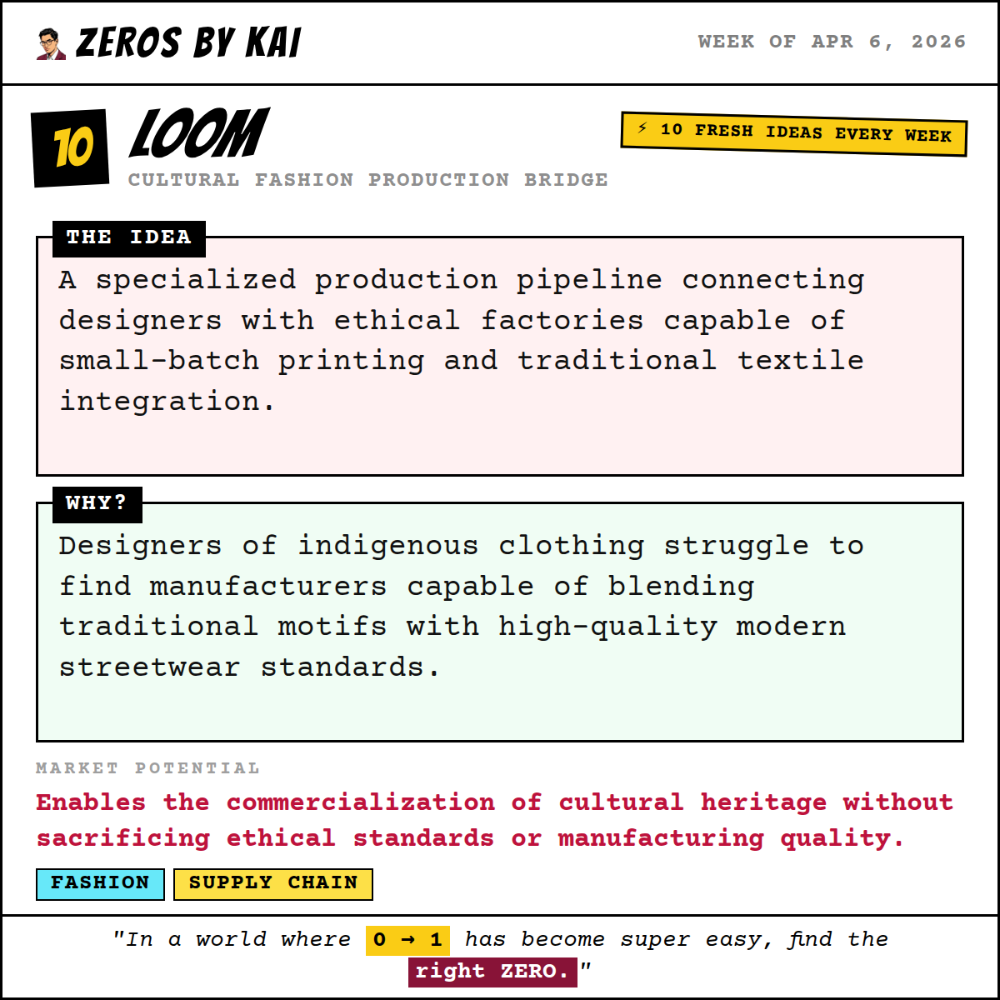

---

