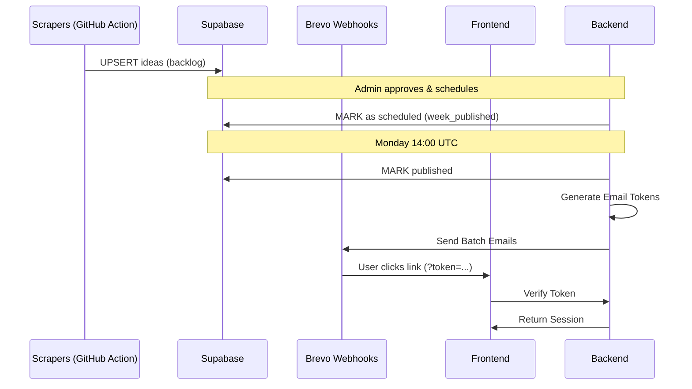

# Architecture & Infrastructure: ZerosByKai

This document describes the technical architecture, communication patterns, and deployment infrastructure of the ZerosByKai platform.

## Architecture Overview

ZerosByKai is a decoupled application consisting of:
1. **Frontend:** Next.js application (Pages Router) deployed to **Vercel**.
2. **Backend:** Node.js/Express application deployed to **Fly.io**.
3. **Database & Auth:** Managed Services provided by **Supabase**.
4. **Email:** Transactional and Marketing emails via **Brevo**.

## 1. System Integration

### API Communication
The frontend communicates with the backend via a RESTful API.
- **Base URL:** `NEXT_PUBLIC_API_URL`
- **Authentication:** Bearer Token (JWT) injected in `Authorization` header by `apiFetch()` helper.
- **Format:** JSON.

### Core Integration Points
| Feature | Frontend Trigger | Backend Endpoint | Logic |
|---------|------------------|------------------|-------|
| **Voting** | `VoteButton.jsx` | `POST /api/votes` | Updates `vote_count` on idea and records user vote. |
| **Login** | `AuthModal.jsx` | `POST /api/auth/post-login` | Syncs subscriber state and triggers welcome email. |
| **Email Token** | `AuthProvider.js` | `GET /api/auth/verify-email-token` | Converts email token to Supabase session. |
| **Subscribe** | `SubscribeModal.jsx`| `POST /api/auth/subscribe` | Creates/Updates subscriber in Supabase & Brevo. |

### Data Flow: Weekly Cycle

## 2. Deployment Infrastructure

### Environments
- **Frontend (Vercel):** `https://zerosbykai.com`
- **Backend (Fly.io):** `zerosbykai-api-prod` (Region: `iad`)
- **Database (Supabase):** Managed PostgreSQL + Auth.

### Secrets & Configuration (Backend)
| Secret | Purpose |
|--------|---------|
| `SUPABASE_SERVICE_KEY` | Admin DB access. |
| `BREVO_API_KEY` | Email delivery. |
| `GEMINI_API_KEY` | AI idea generation. |
| `EMAIL_TOKEN_SECRET` | Secure link signing. |
| `BREVO_WEBHOOK_SECRET` | Webhook verification. |

## 3. Operations

### CD/CD Pipelines
- **Weekly Batch:** GitHub Action on Monday 14:00 UTC.
- **Scraping:** GitHub Action on Sunday.
- **Frontend:** Vercel auto-deploy on `main` push.
- **Backend:** `fly deploy` from `backend/`.

### Monitoring
- **Logs:** `fly logs` (Backend), Vercel Dashboard (Frontend).
- **Audit:** Brevo Dashboard for email deliverability/stats.
- **Security:** PII masking in debug logs; webhook token verification.
