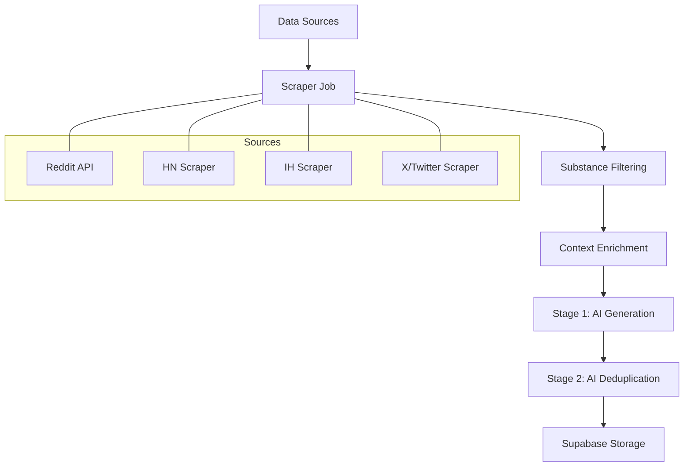

# Technical Walkthrough: Idea Extraction Pipeline

This document outlines the end-to-end technical process of how ZerosByKai extracts, processes, and stores startup opportunities ("Zeros").

---

## 1. Data Collection (Scraping)
The process begins in `backend/src/jobs/scrapers/run_scrapers.js`. The `runScraperFlow` function orchestrates fetching data from four primary sources:
- **Reddit**: Targeted scraping of business and startup-focused subreddits (e.g., `r/SaaS`, `r/Business_Ideas`).
- **Hacker News**: Latest Show HN and Ask HN stories.
- **Indie Hackers**: High-engagement posts from the IH community.
- **X (Twitter)**: Trending signals fetched via Apify.

**Parallelism**: All scrapers run concurrently using `Promise.allSettled` to ensure one source failure doesn't block the entire cycle.

---

## 2. Filtering & Normalization
Before AI processing, the data is cleaned:
- **Freshness**: Only posts/tweets from the last **15 days** are considered.
- **Substance**: Systems filters out "low-signal" content. Reddit/HN/IH posts must have a title > 20 chars or body > 40 chars. X tweets are exempt from this due to their brevity.
- **Sanitization**: Titles and bodies are truncated to avoid extremely large prompts that might exceed token limits or increase latency.

---

## 3. Context Preparation (Exclusion List)
To prevent generating duplicates of ideas the system has *already* published, the scraper fetches existing context:
- **Database Query**: Retrieves the **100 most recent** idea titles (determined by `created_at` DESC).
- **Verification Mechanism**: The exclusion actually occurs in the **AI Prompt**. The AI is provided with a list labeled "EXCLUSION LIST (Do NOT repeat these ideas)" and is explicitly instructed not to generate concepts that overlap with these titles.
- **Intelligent Batching**: The 100 titles are split into two batches within the prompt:
    1. **MOST RECENT (1-50)**: High priority exclusion.
    2. **EARLIER (51-100)**: Global context exclusion.

---

## 4. Stage 1: Initial Idea Generation
Total source data is sliced (up to 40 posts per source) and sent to `AIService.generateIdeas`.
- **Source-Specific Context**: Ideas are generated one source at a time to maintain context.
- **AI Models**: Uses a fallback chain (Gemini Flash -> Gemini Flash-8B) to ensure reliability.
- **Creative Naming**: The AI is instructed to generate **eccentric, brandable names** (e.g., "Neighborhood", "BioFlow") based on the **Solution** vibe, strictly avoiding technical descriptors like "Optimizer" or "Platform".

---

## 5. Stage 2: Synthesis & Deduplication
The raw ideas from all sources are combined and passed to `AIService.dedupeAndSynthesizeIdeas`.
- **Duplicate Identification**: AI identifies identical concepts across different sources.
- **Merger**: Similar paint points are synthesized into one high-quality, comprehensive idea.
- **Curation**: The list is pruned for novelty, feasibility, and clarity.
- **Final Output**: Up to 40 unique, high-character "Zeros" are returned in a standard JSON format.

---

## 6. Storage & Monday Readiness
The final ideas are stored in the **Supabase `ideas` table** with a status of `backlog`.
- **Fields**: Each record includes `name`, `title`, `problem`, `solution`, `target_audience`, `why_it_matters`, and `tags`.
- **Review Cycle**: From the `backlog`, ideas are then manually or automatically promoted to `scheduled` for the upcoming Monday batch.

### Key Files
- `backend/src/jobs/scrapers/run_scrapers.js`: Flow orchestration.
- `backend/src/services/aiService.js`: Prompt engineering and AI logic.
- `backend/src/config/supabase.js`: Database bridge.

---

## 7. Exclusion Timing: Post-Scraping
A key architectural detail is that the exclusion list is applied **Post-Scraping** but **Pre-Generation**:

1.  **Scraping**: Fetches *all* raw signals from Reddit, HN, etc., regardless of past ideas.
2.  **Context Loading**: Fetches the last 100 published ideas from the DB.
3.  **AI Filtering**: During generation, the AI reads the raw signals *and* the exclusion list. It rejects signals that would lead to a duplicate and only synthesizes truly novel "Zeros".

This ensures we don't accidentally miss a new angle on a recurring problem just because we didn't scrape the post.
